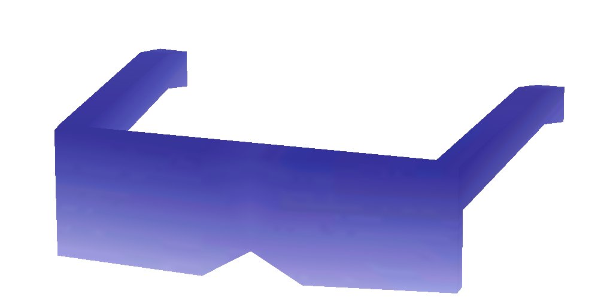
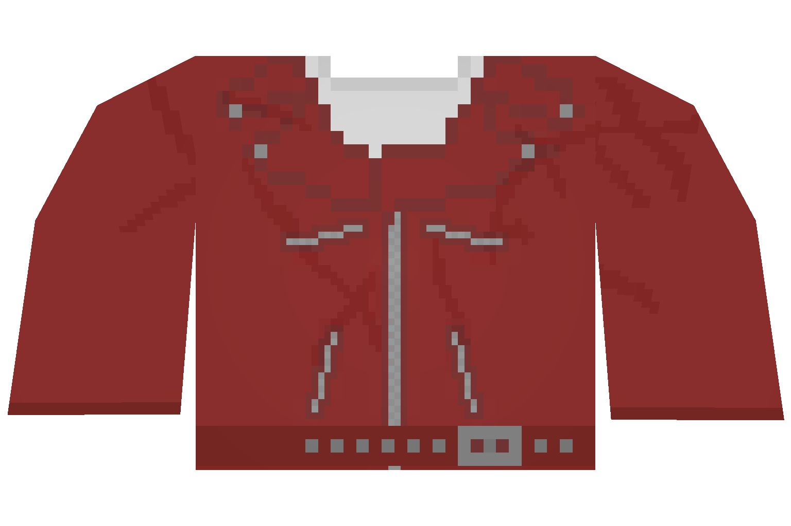
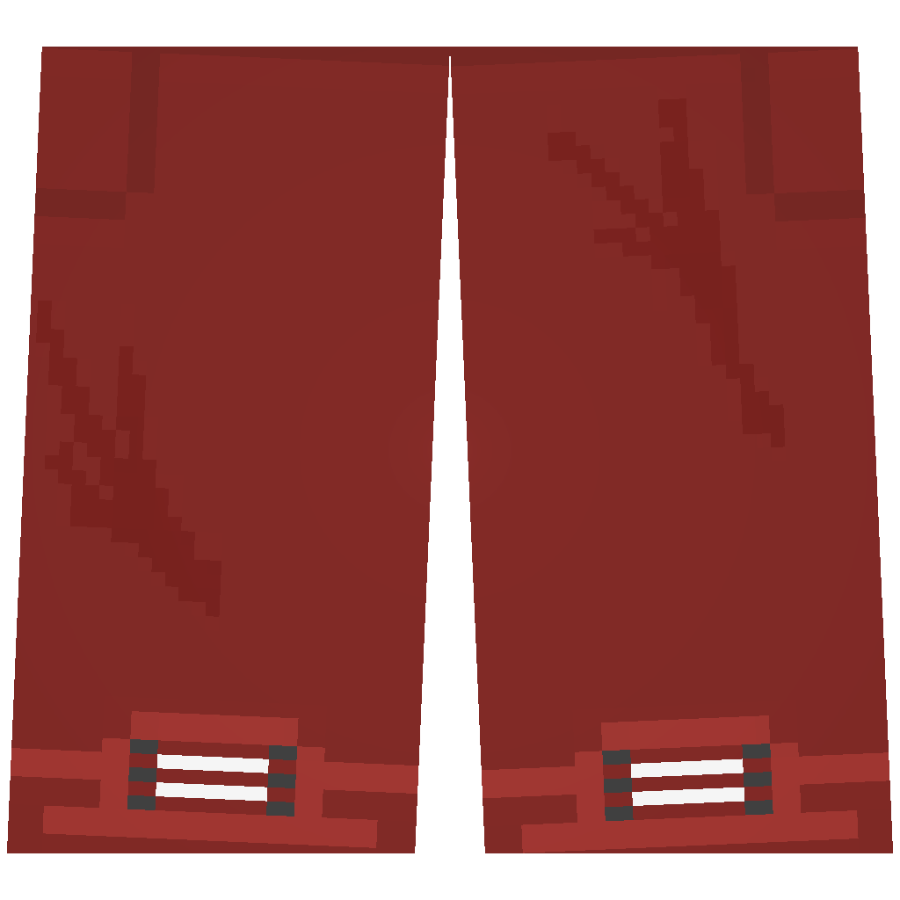

# 📀 Donator

***

<table data-view="cards" data-full-width="true"><thead><tr><th></th><th></th><th></th><th data-hidden data-card-cover data-type="files"></th></tr></thead><tbody><tr><td>Patron Hat  Patron Glasses  Patron Vest  Patron Shirt  Patron Pants </td><td></td><td></td><td><a href="../../.gitbook/assets/image_2023-08-31_124425761.png">image_2023-08-31_124425761.png</a></td></tr><tr><td>Supporter Hat  Supporter Glasses  Supporter Vest  Supporter Shirt  Supporter Pants </td><td></td><td></td><td><a href="../../.gitbook/assets/Supporter.png">Supporter.png</a></td></tr><tr><td>Promoter Hat  Promoter Glasses  Promoter Vest  Promoter Shirt  Promoter Pants </td><td></td><td></td><td><a href="../../.gitbook/assets/Promoter.png">Promoter.png</a></td></tr><tr><td>Donor Hat  Donor Glasses   Donor Vest  Donor Shirt  Donor Pants </td><td></td><td></td><td><a href="../../.gitbook/assets/Donor.png">Donor.png</a></td></tr><tr><td>Sponsor Hat  Sponsor Glasses  Sponsor Vest  Sponsor Shirt  Sponsor Pants </td><td></td><td></td><td><a href="../../.gitbook/assets/Sponsor.png">Sponsor.png</a></td></tr><tr><td>Investor Hat  Investor Glasses  Investor Vest  Investor Shirt  Investor Pants </td><td></td><td></td><td><a href="../../.gitbook/assets/Investor.png">Investor.png</a></td></tr></tbody></table>

***

