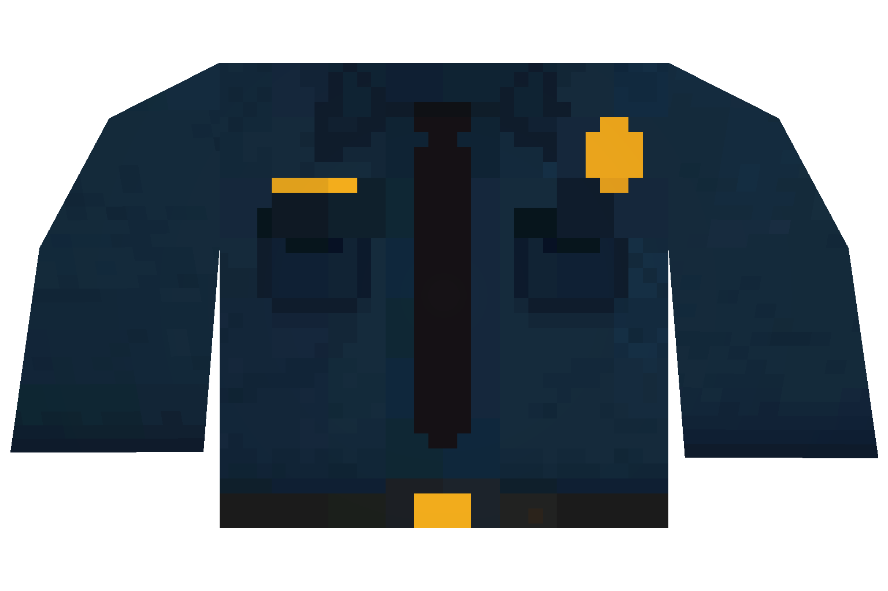
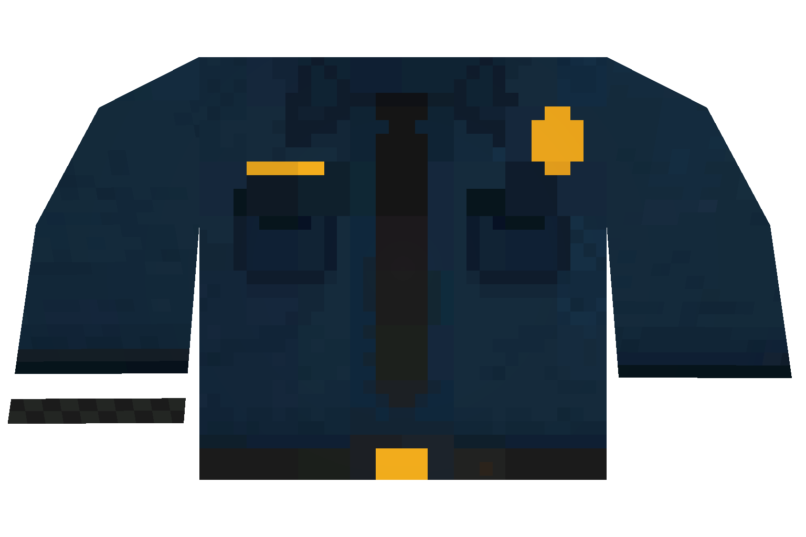
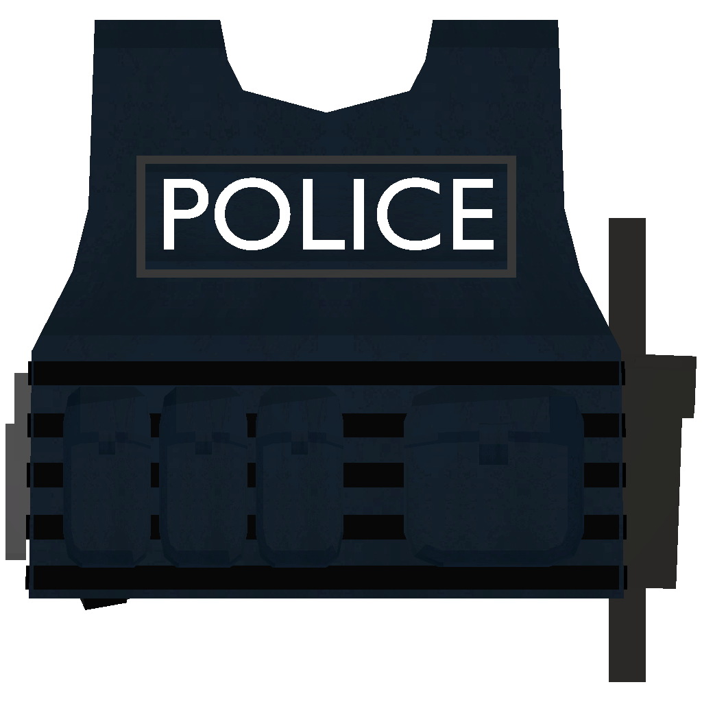
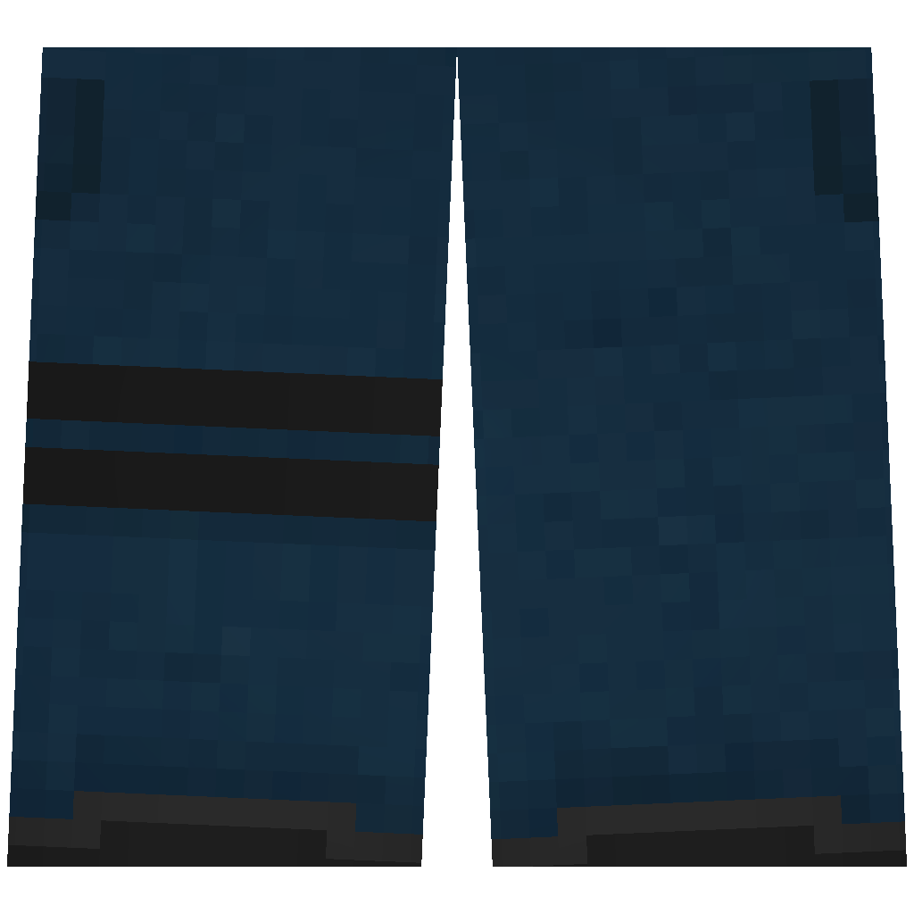
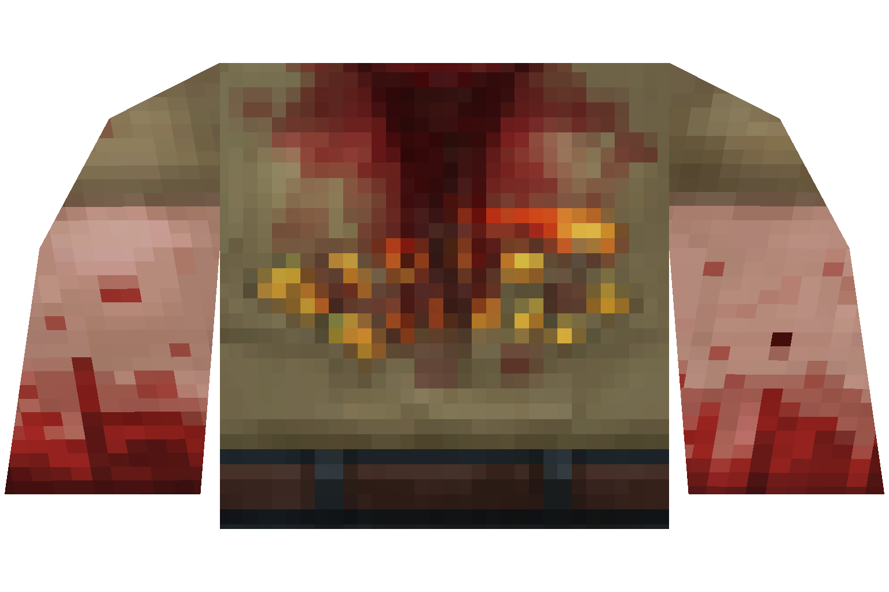

# 👮♂ Faction



<table><thead><tr><th width="169.66666666666666">Name</th><th width="182">Info</th><th></th></tr></thead><tbody><tr><td>Police Chief Hat</td><td>💪Armor: 0.8 📥Spaces: N/A</td><td></td></tr><tr><td>Police Hat</td><td>
💪Armor: 0.9 📥Spaces: N/A

</td><td></td></tr><tr><td>Police Cadet</td><td>💪Armor: 0.85 📥Spaces: 12</td><td></td></tr><tr><td>Police Officer</td><td>💪Armor: 0.85 📥Spaces: 12</td><td></td></tr><tr><td>Police Corporal</td><td>💪Armor: 0.85 📥Spaces: 12</td><td></td></tr><tr><td>Police Sergeant</td><td>💪Armor: 0.85 📥Spaces: 12</td><td></td></tr><tr><td>Police Lieutenant</td><td>💪Armor: 0.8 📥Spaces: 12</td><td></td></tr><tr><td>Police Captain</td><td>💪Armor: 0.8 📥Spaces: 12</td><td></td></tr><tr><td>Police Major</td><td>💪Armor: 0.75 📥Spaces: 15</td><td></td></tr><tr><td>Police Colonel</td><td>💪Armor: 0.85 📥Spaces: 12</td><td></td></tr><tr><td>Police Deputy Chief</td><td>💪Armor: 0.7 📥Spaces: 20</td><td></td></tr><tr><td><mark style="color:red;">Police Chief</mark></td><td>💪Armor: 0.7 📥Spaces: 20</td><td></td></tr><tr><td>Police Vest</td><td>💪Armor: 0.45 📥Spaces: 15</td><td></td></tr><tr><td><mark style="color:red;">Police Pants</mark></td><td>💪Armor: 0.85 📥Spaces: 12</td><td></td></tr></tbody></table>

<figure><figcaption>
What is this?
</figcaption></figure>











