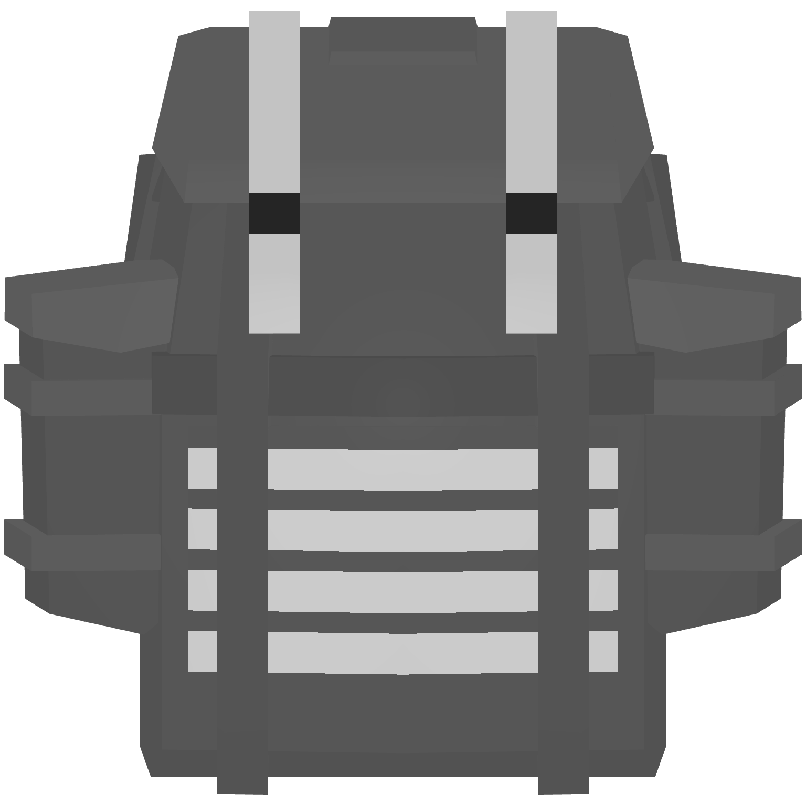
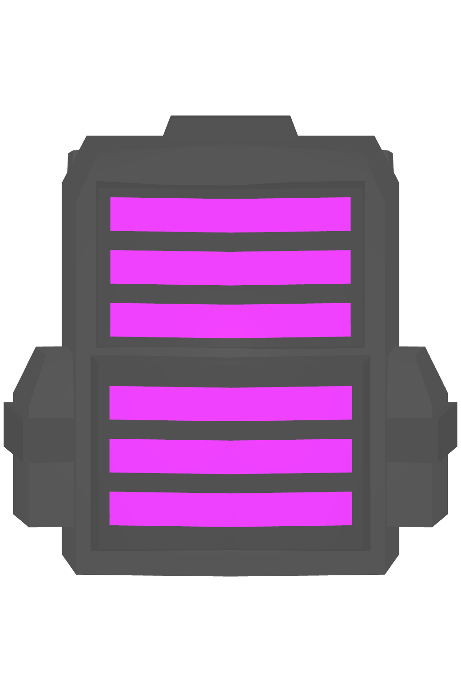
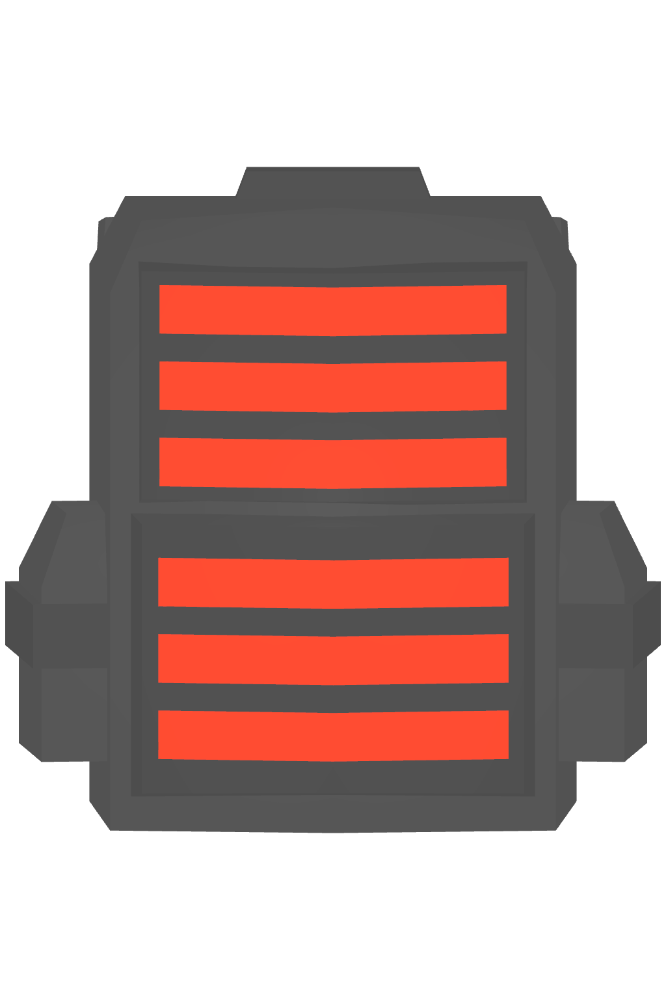
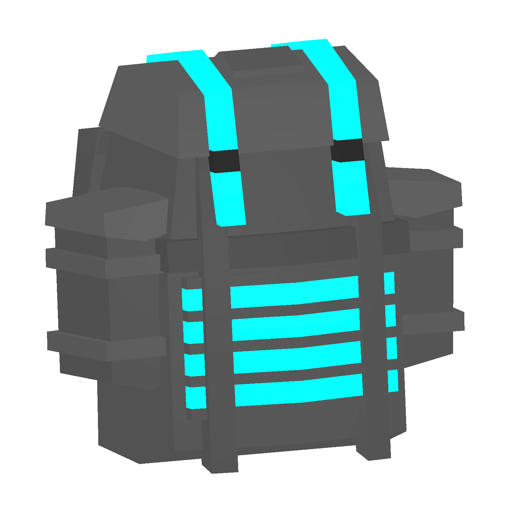
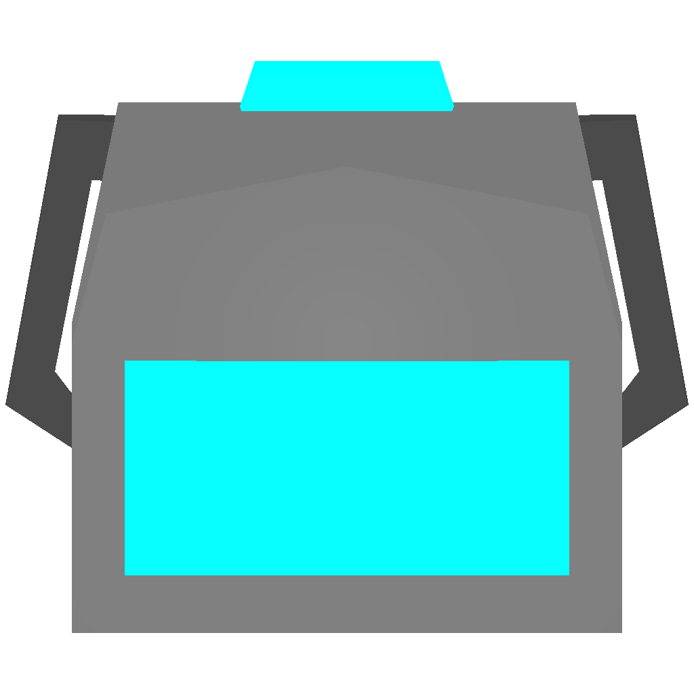
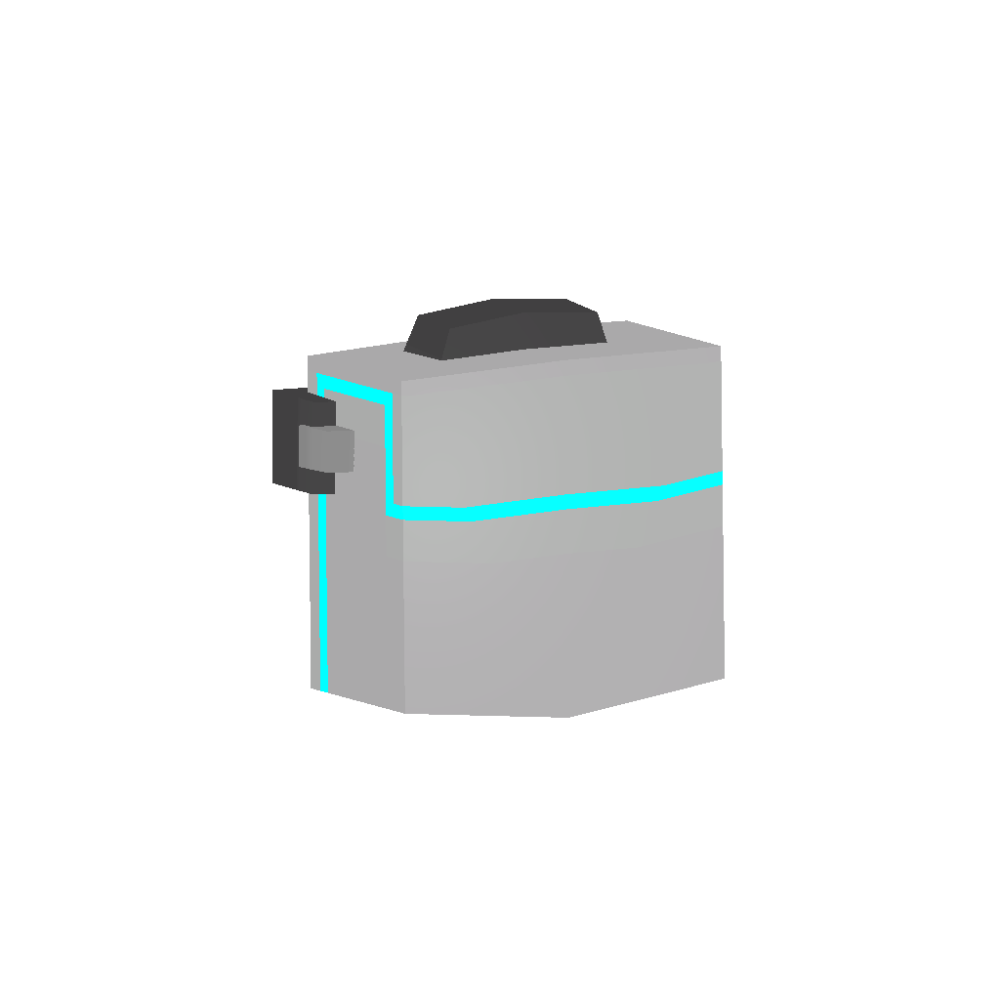
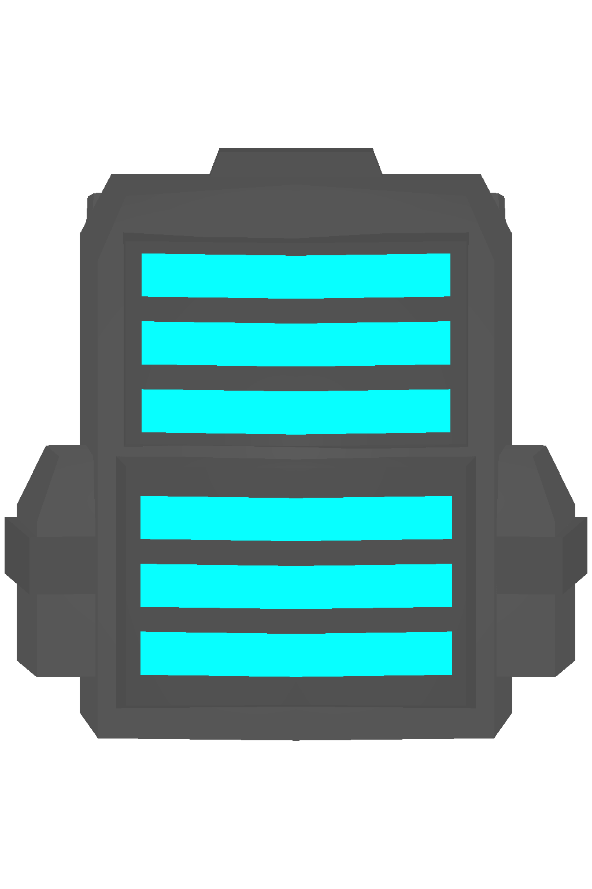
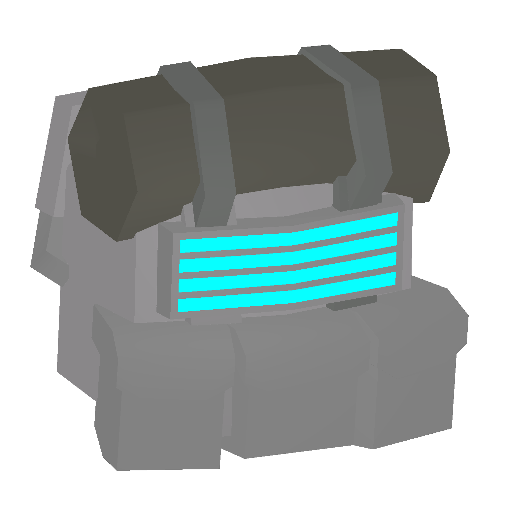

# 🎒 Backpack


<mark style="color:red;background-color:orange;">**WORKING IN PROGRESS**</mark>\
**These recipe are pain to get. Might take some times.**


To acquire a T6 item, you must fulfill the following requirements: complete the <mark style="color:red;">**main quest**</mark>, possess the corresponding blueprint, and be a donator to craft it.




<table><thead><tr><th width="116">Tier\Name</th><th width="107">Rucksack</th><th width="109">Knapsack</th><th width="156">Document bag</th><th width="101">Coyote Pack</th><th>Alice</th></tr></thead><tbody><tr><td>Tier 1</td><td></td><td></td><td></td><td></td><td></td></tr><tr><td>Tier 2</td><td></td><td></td><td></td><td></td><td></td></tr><tr><td>Tier 3</td><td></td><td></td><td></td><td></td><td></td></tr><tr><td>Tier 4</td><td></td><td></td><td></td><td></td><td></td></tr><tr><td>Tier 5</td><td></td><td></td><td></td><td></td><td></td></tr><tr><td>Tier 6</td><td></td><td></td><td></td><td></td><td></td></tr><tr><td>Tier 7</td><td></td><td></td><td></td><td></td><td></td></tr></tbody></table>



Recipe

<table data-view="cards"><thead><tr><th></th><th></th><th></th><th data-hidden data-card-cover data-type="files"></th></tr></thead><tbody><tr><td></td><td><strong>T1 > T2 Rucksack</strong></td><td> <strong>Cost:</strong> 27 Pure Bauxite + 9 Pure Lead + 9 Pure Tin</td><td><a href="../.gitbook/assets/T2Pack_14012.png">T2Pack_14012.png</a></td></tr><tr><td></td><td><strong>T1 > T2 Knapsack</strong></td><td> <strong>Cost:</strong> 27 Pure Bauxite + 9 Pure Lead + 9 Pure Tin</td><td><a href="../.gitbook/assets/T2Pack_14082.png">T2Pack_14082.png</a></td></tr><tr><td></td><td><strong>T1 > T2 Document bag</strong></td><td> <strong>Cost:</strong> 27 Pure Bauxite + 9 Pure Lead + 9 Pure Tin</td><td><a href="../.gitbook/assets/T2Pack_14052.png">T2Pack_14052.png</a></td></tr><tr><td><strong>T1 > T2 Coyote</strong></td><td></td><td><strong>Cost:</strong> 27 Pure Bauxite + 9 Pure Lead + 9 Pure Tin</td><td><a href="../.gitbook/assets/T2Pack_14042.png">T2Pack_14042.png</a></td></tr><tr><td><strong>T1 > T2 Alicepack</strong></td><td></td><td><strong>Cost:</strong> 27 Pure Bauxite + 9 Pure Lead + 9 Pure Tin</td><td><a href="../.gitbook/assets/T2Pack_14002.png">T2Pack_14002.png</a></td></tr></tbody></table>



### Tier 1

| Tier 1 | Rucksack                                 | Knapsnack                                | Documents Bag                            | Coyote Pack                              | Alicepack                                |
| ------ | ---------------------------------------- | ---------------------------------------- | ---------------------------------------- | ---------------------------------------- | ---------------------------------------- |
|        | 
Storage: 49 Speed Mutli: 0.850
 | 
Storage: 30 Speed Mutli: 0.935
 | 
Storage: 16 Speed Mutli: 0.975
 | 
Storage: 55 Speed Mutli: 0.960
 | 
Storage: 42 Speed Mutli: 0.870
 |

### Tier 2

| Tier 2 | Rucksack                                 | Knapsnack                                | Documents Bag                            | Coyote Pack                              | Alicepack                                |
| ------ | ---------------------------------------- | ---------------------------------------- | ---------------------------------------- | ---------------------------------------- | ---------------------------------------- |
|        | 
Storage: 64 Speed Mutli: 0.855
 | 
Storage: 42 Speed Mutli: 0.940
 | 
Storage: 25 Speed Mutli: 0.980
 | 
Storage: 65 Speed Mutli: 0.965
 | 
Storage: 42 Speed Mutli: 0.880
 |

### Tier 3

| Tier 3 | Rucksack                                 | Knapsnack                                | Documents Bag                            | Camping Pack                             | Alicepack                                |
| ------ | ---------------------------------------- | ---------------------------------------- | ---------------------------------------- | ---------------------------------------- | ---------------------------------------- |
|        | 
Storage: 81 Speed Mutli: 0.860
 | 
Storage: 56 Speed Mutli: 0.945
 | 
Storage: 36 Speed Mutli: 0.985
 | 
Storage: 85 Speed Mutli: 0.880
 | 
Storage: 63 Speed Mutli: 0.890
 |

### Tier 4

| Tier 4 | Rucksack                                  | Knapsnack                                | Documents Bag                            | Coyote Pack                              | Alicepack                                |
| ------ | ----------------------------------------- | ---------------------------------------- | ---------------------------------------- | ---------------------------------------- | ---------------------------------------- |
|        | 
Storage: 100 Speed Mutli: 0.865
 | 
Storage: 72 Speed Mutli: 0.955
 | 
Storage: 49 Speed Mutli: 0.990
 | 
Storage: 85 Speed Mutli: 0.975
 | 
Storage: 81 Speed Mutli: 0.895
 |

### Tier 5

| Tier 5 | Rucksack                                  | Knapsnack                                | Documents Bag                            | Coyote Pack                              | Alicepack                                 |
| ------ | ----------------------------------------- | ---------------------------------------- | ---------------------------------------- | ---------------------------------------- | ----------------------------------------- |
|        | 
Storage: 144 Speed Mutli: 0.870
 | 
Storage: 90 Speed Mutli: 0.970
 | 
Storage: 64 Speed Mutli: 0.995
 | 
Storage: 95 Speed Mutli: 0.985
 | 
Storage: 110 Speed Mutli: 0.900
 |

### Tier 6

<table><thead><tr><th width="193">Rucksack</th><th width="193">Knapsnack</th><th width="178">Documents Bag</th><th width="180">Coyote Pack</th><th width="183">Alicepack</th></tr></thead><tbody><tr><td>Storage: 182 Speed Mutli: 0.875</td><td>Storage: 110 Speed Mutli: 0.980</td><td>Storage: 81 Speed Mutli: 1.000</td><td>Storage: 105 Speed Mutli: 1.000</td><td>Storage: 143 Speed Mutli: 0.905</td></tr></tbody></table>

### Tier 7

###

| Rucksack | Knapsnack | Documents Bag | Coyote Pack | Alicepack |
| -------- | --------- | ------------- | ----------- | --------- |
|          |           |               |             |           |


