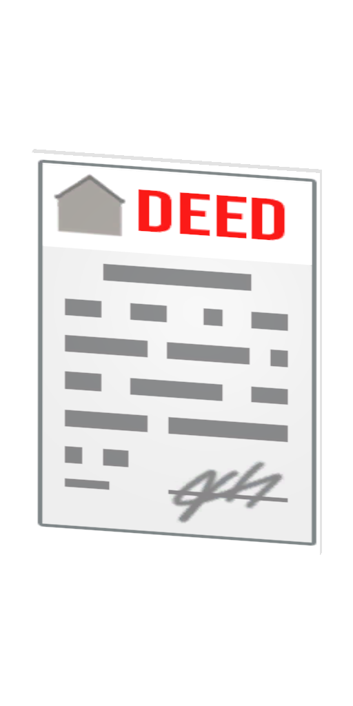
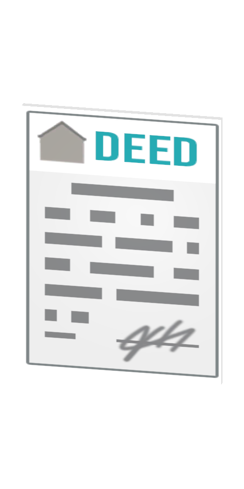
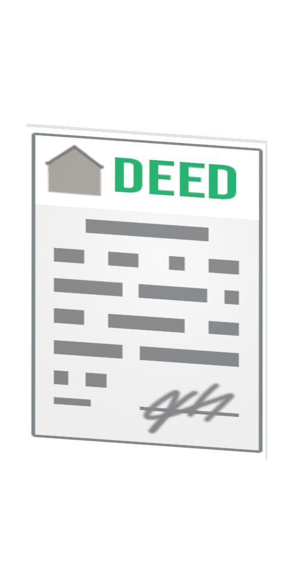
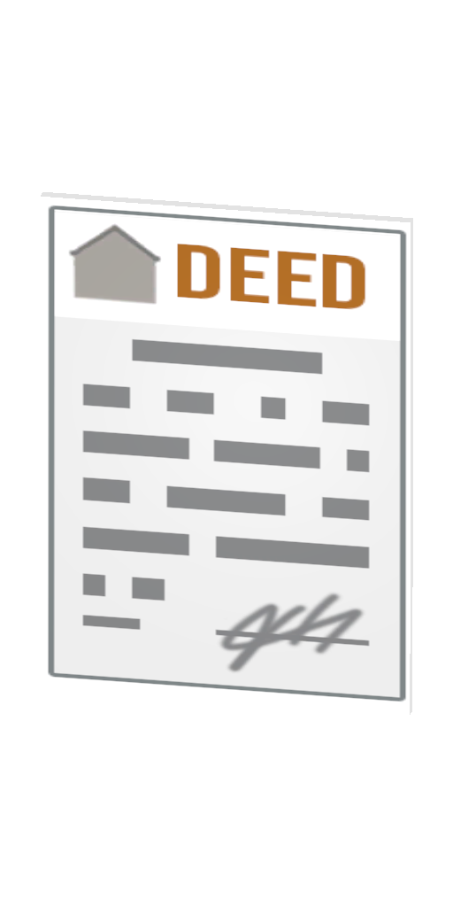
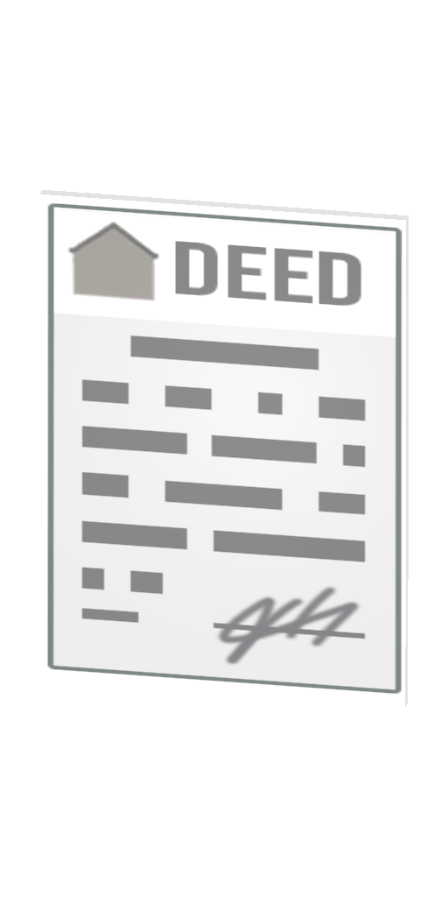
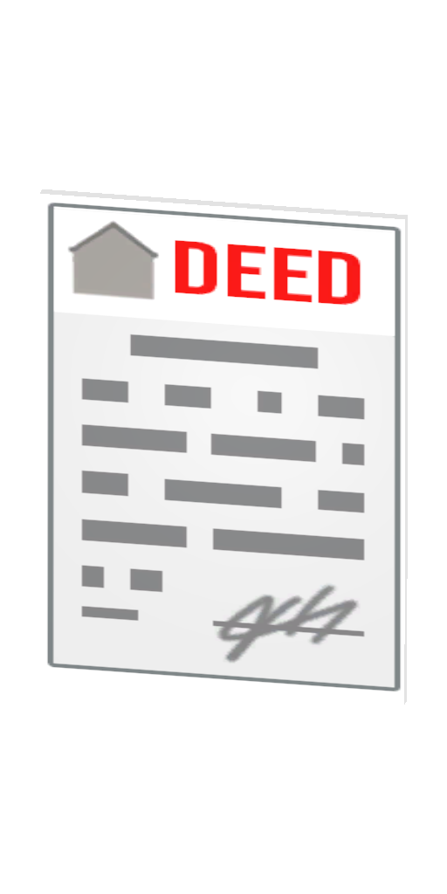
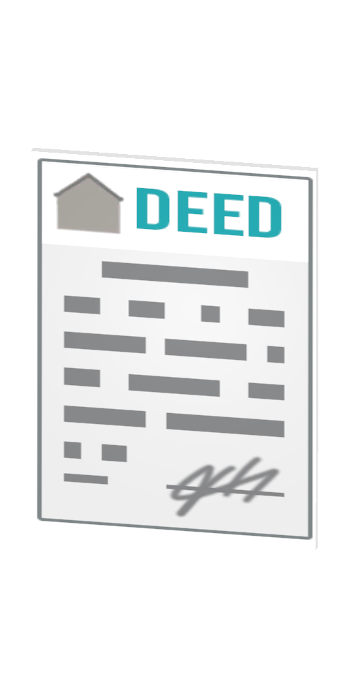
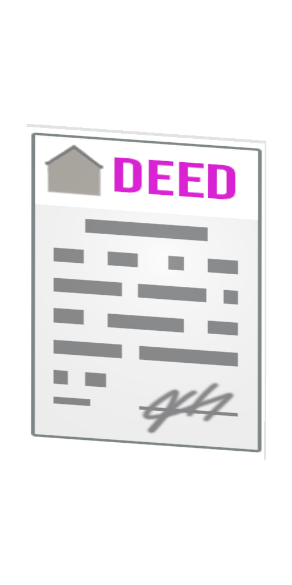

# 🏠 Deed

This item will only last until Stilau is done working with the house plugin.

### Inside Northwich

<table><thead><tr><th width="132.33333333333331">Name</th><th width="493">Image</th><th>Price</th></tr></thead><tbody><tr><td>Apartment</td><td></td><td>235,000</td></tr><tr><td>Firestation</td><td></td><td>275,000</td></tr><tr><td>Floor</td><td></td><td>90,000</td></tr><tr><td>MallShop</td><td></td><td>45,000</td></tr><tr><td>Shop</td><td></td><td>115,000</td></tr></tbody></table>

### Outside Northwich

<table><thead><tr><th width="132.33333333333331">Name</th><th width="494">Image</th><th>Price</th></tr></thead><tbody><tr><td>Apartment</td><td></td><td>235,000</td></tr><tr><td>Barn</td><td></td><td>65,000</td></tr><tr><td>Factory</td><td></td><td>200,000</td></tr><tr><td>Firestation</td><td></td><td>135,000</td></tr><tr><td>Floor</td><td></td><td>50,000</td></tr><tr><td>Large Hangar</td><td></td><td>475,000</td></tr><tr><td>Mall Shop</td><td></td><td>20,000</td></tr><tr><td>Mansion</td><td></td><td>475,000</td></tr><tr><td>Small Hangar</td><td></td><td>225,000</td></tr></tbody></table>
