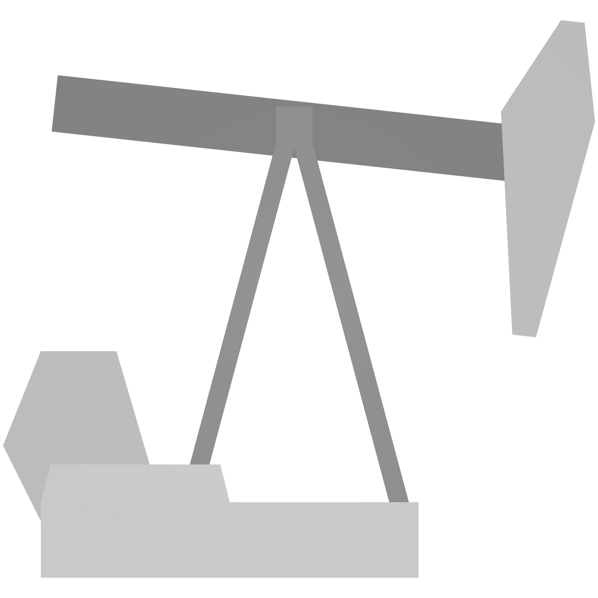
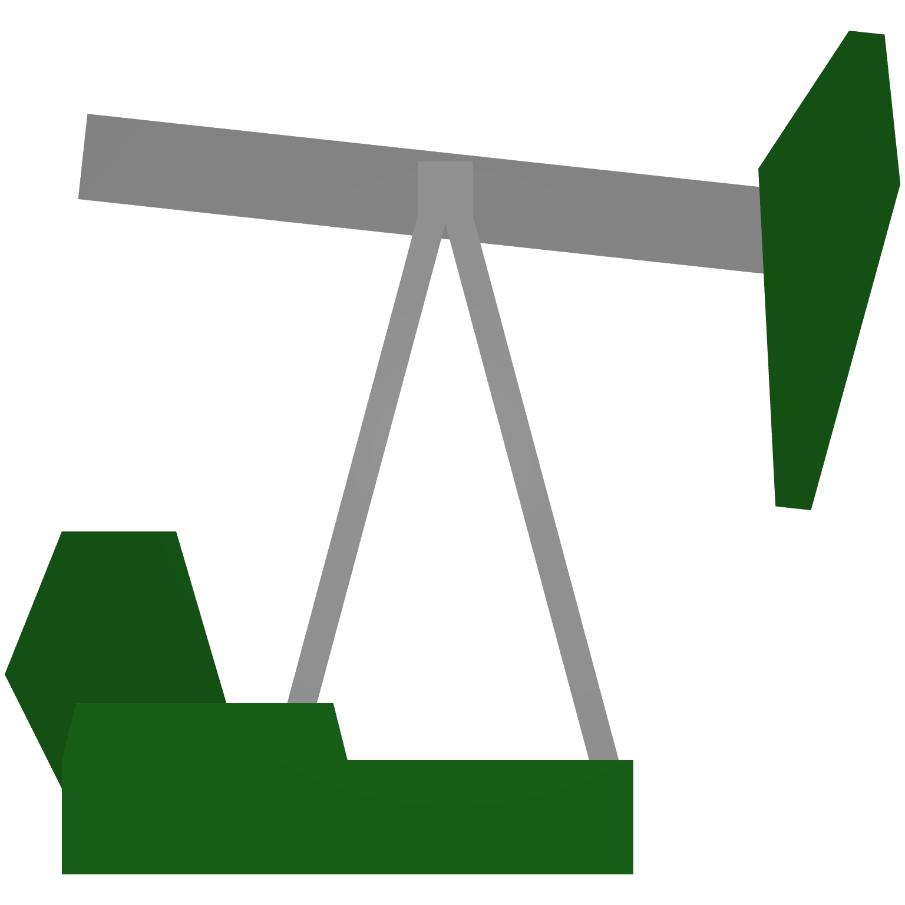
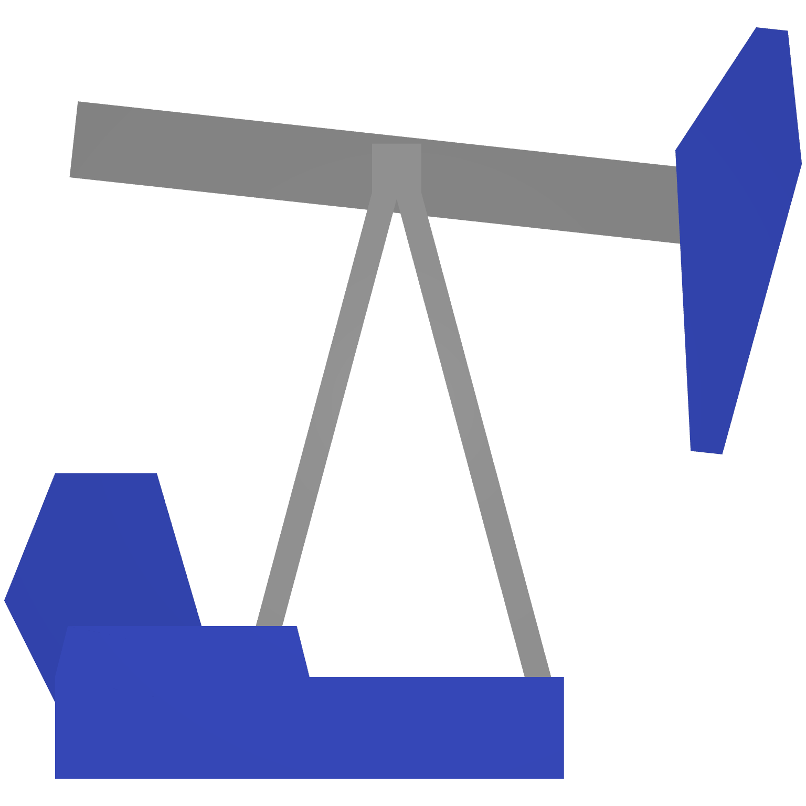
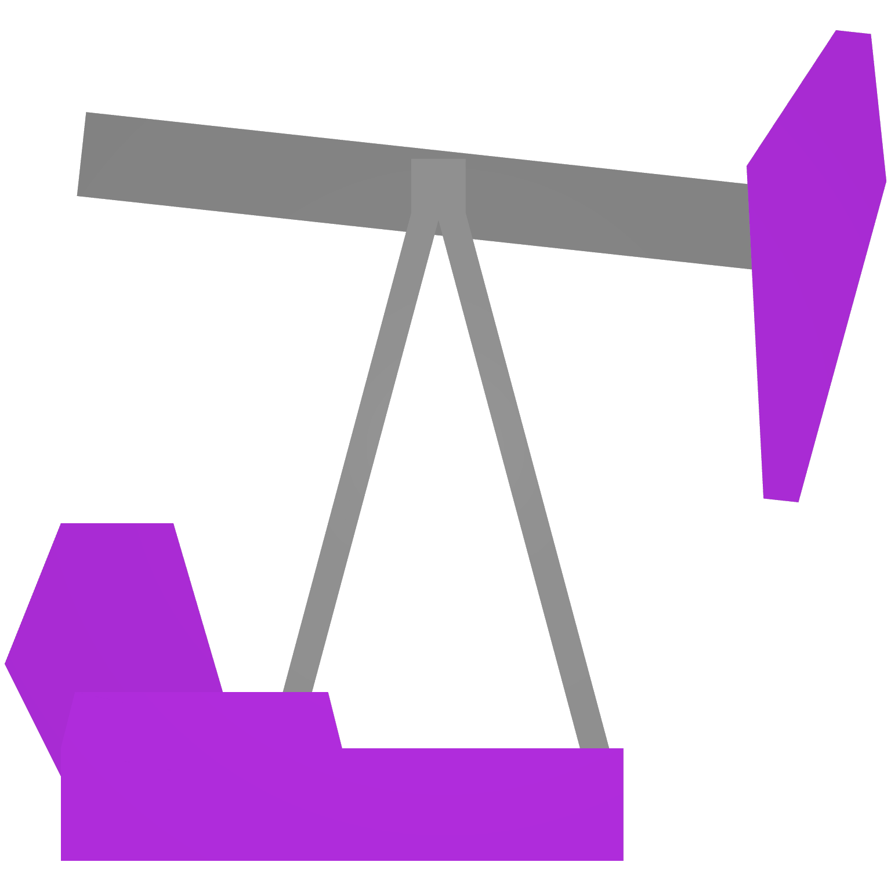
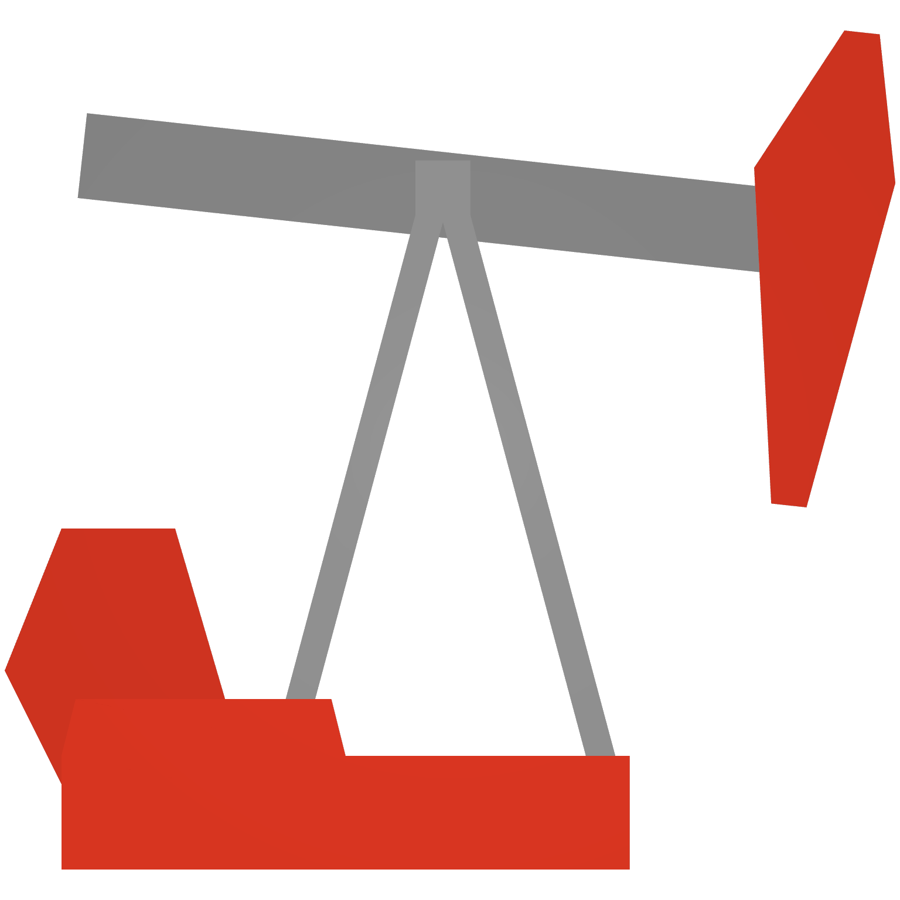
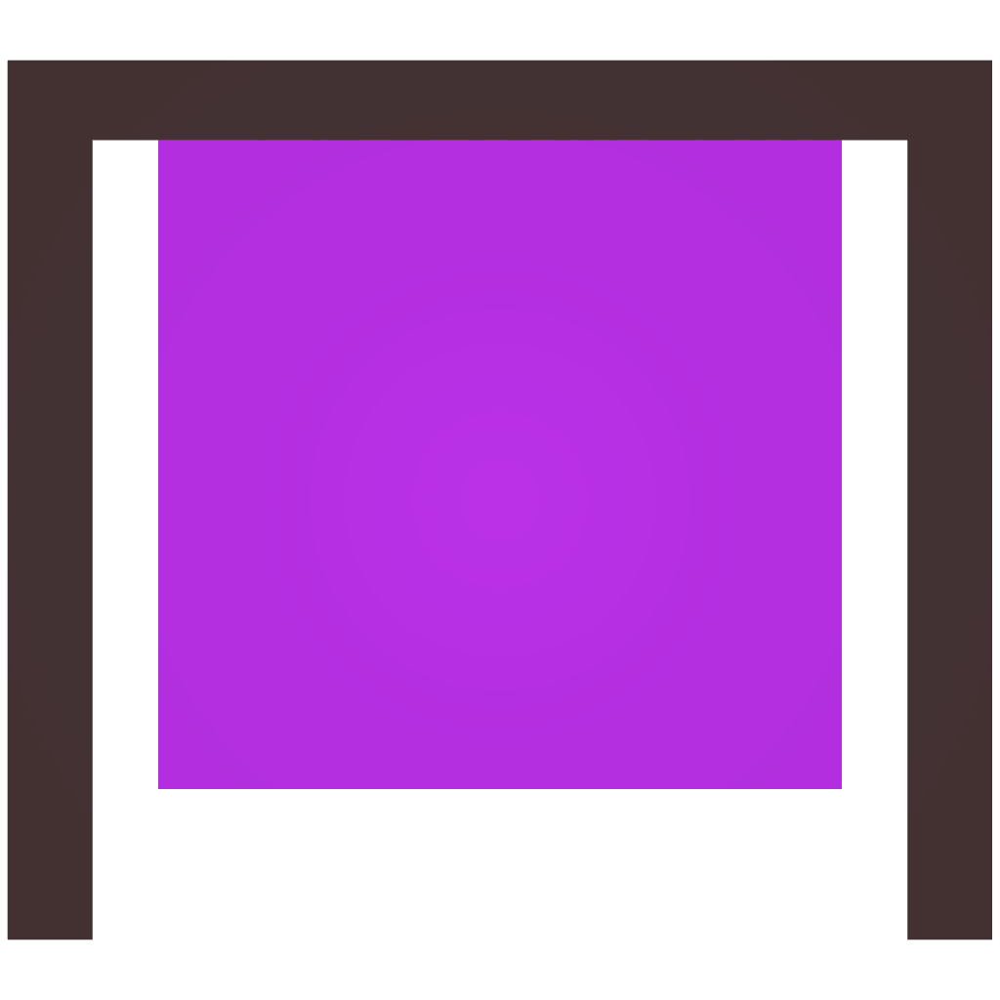

# ⛽ Gas


<mark style="color:red;background-color:orange;">**WORKING IN PROGRESS**</mark>


To acquire a T6 item, you must fulfill the following requirements: complete the <mark style="color:red;">**main quest**</mark>, possess the corresponding blueprint, and be a donator to craft it.




<table><thead><tr><th width="123">Names</th><th width="104" data-type="checkbox">Blueprint</th><th width="97" data-type="checkbox">Donator</th><th width="72" data-type="checkbox">Coins</th><th width="133">Fuel Storage</th><th>Recipe</th></tr></thead><tbody><tr><td>T1 Gas Can</td><td>false</td><td>false</td><td>false</td><td>250</td><td></td></tr><tr><td>T2 Gas Can</td><td>false</td><td>false</td><td>false</td><td>700</td><td></td></tr><tr><td>T3 Gas Can</td><td>false</td><td>false</td><td>false</td><td>1050</td><td></td></tr><tr><td>T4 Gas Can</td><td>true</td><td>false</td><td>false</td><td>1400</td><td></td></tr><tr><td>T5 Gas Can</td><td>true</td><td>false</td><td>false</td><td>1750</td><td></td></tr><tr><td>T6 Gas Can</td><td>true</td><td>true</td><td>false</td><td>2100</td><td></td></tr><tr><td>T7 Gas Can</td><td>true</td><td>true</td><td>true</td><td>2450</td><td></td></tr></tbody></table>





<table><thead><tr><th width="126.66666666666666">Names</th><th width="103" data-type="checkbox">Blueprint</th><th width="100" data-type="checkbox">Donator</th><th data-type="checkbox"></th><th width="143">Fuel Capacity</th><th>Recipe</th></tr></thead><tbody><tr><td>T1 Oil</td><td>false</td><td>false</td><td>false</td><td>1000</td><td></td></tr><tr><td>T2 Oil</td><td>false</td><td>false</td><td>false</td><td>1800</td><td></td></tr><tr><td>T3 Oil</td><td>false</td><td>false</td><td>false</td><td>2600</td><td></td></tr><tr><td>T4 Oil</td><td>true</td><td>false</td><td>false</td><td>3400</td><td></td></tr><tr><td>T5 Oil</td><td>true</td><td>false</td><td>false</td><td>4200</td><td></td></tr><tr><td>T6 Oil</td><td>true</td><td>true</td><td>false</td><td>5000</td><td></td></tr><tr><td>T7 Oil</td><td>true</td><td>true</td><td>true</td><td>5800</td><td></td></tr></tbody></table>




<table><thead><tr><th width="154.66666666666666">Name</th><th width="104" data-type="checkbox">Blueprint</th><th width="109" data-type="checkbox">Donator</th><th data-type="checkbox"></th><th width="182">Info</th><th>Recipe</th></tr></thead><tbody><tr><td>T1 Generator</td><td>false</td><td>false</td><td>false</td><td>Capacity        2000 Wirerange      12.0 Burn               40.0</td><td></td></tr><tr><td>T2 Generator</td><td>false</td><td>false</td><td>false</td><td>Capacity        2800 Wirerange      16.0 Burn               36.0</td><td></td></tr><tr><td>T3 Generator</td><td>false</td><td>false</td><td>false</td><td>Capacity        3600 Wirerange      20.0 Burn               32.0</td><td></td></tr><tr><td>T4 Generator</td><td>true</td><td>false</td><td>false</td><td>Capacity        4400 Wirerange      24.0 Burn               28.0</td><td></td></tr><tr><td>T5 Generator</td><td>true</td><td>false</td><td>false</td><td>Capacity        5200 Wirerange      28.0 Burn               24.0</td><td></td></tr><tr><td>T6 Generator</td><td>true</td><td>true</td><td>false</td><td>Capacity        6000 Wirerange      32.0 Burn               20.0</td><td></td></tr><tr><td>T7 Generator</td><td>true</td><td>true</td><td>true</td><td></td><td></td></tr></tbody></table>


