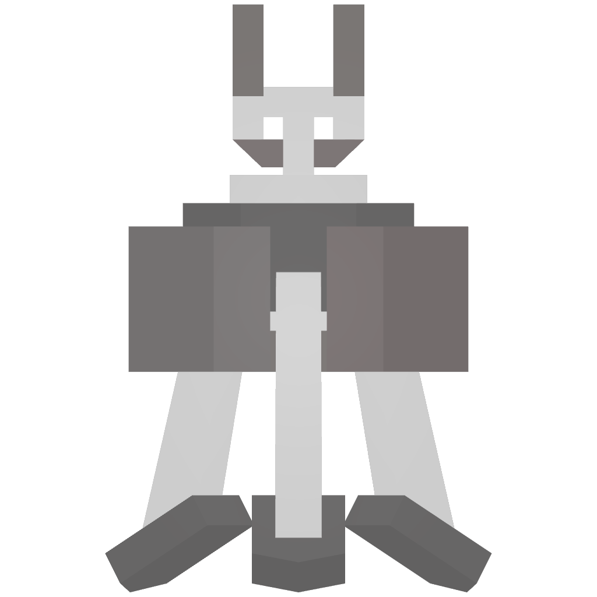
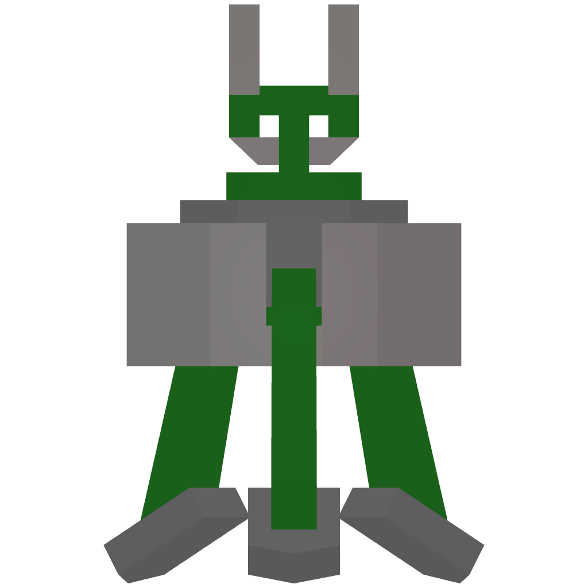
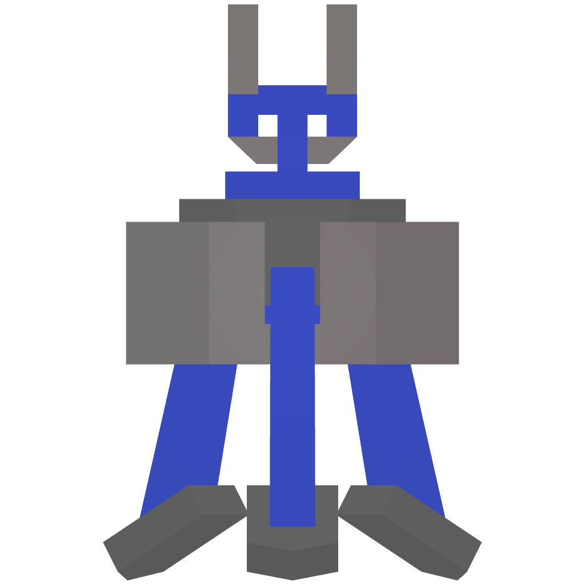
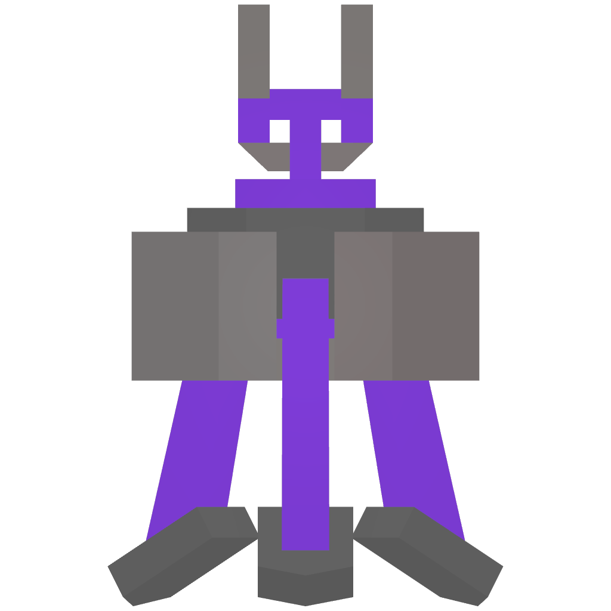
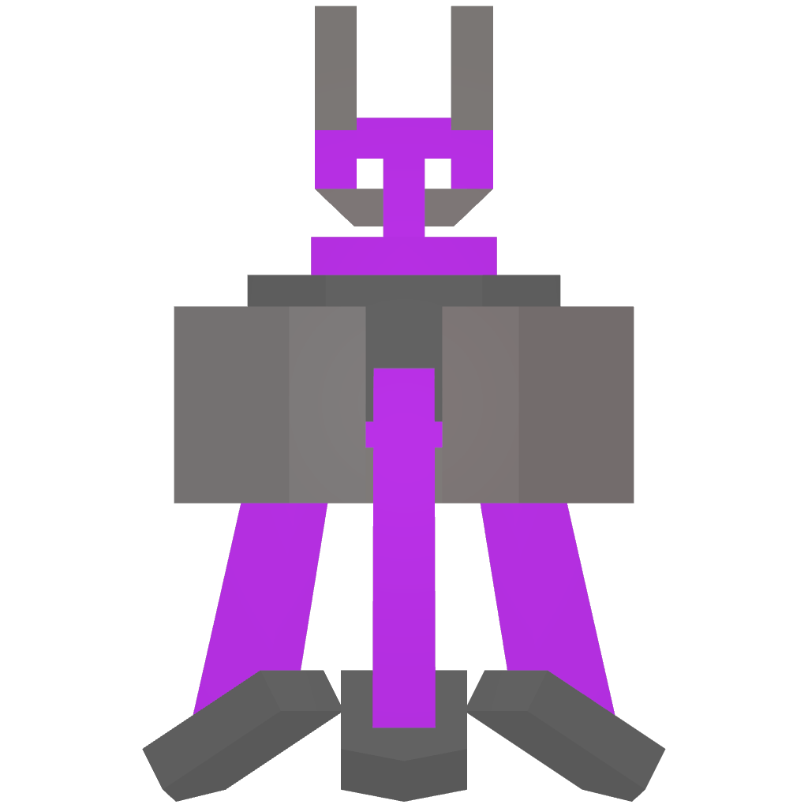
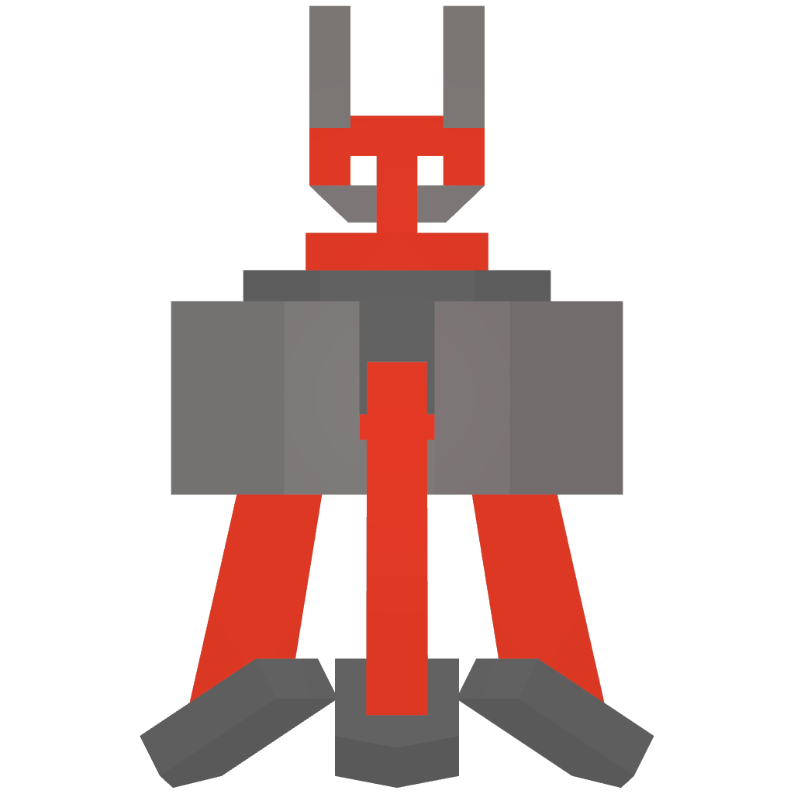

# 📹 Sentry


<mark style="color:red;background-color:orange;">**WORKING IN PROGRESS**</mark>\
**Current information are from BETA Stage, stuff may change in future.**


To acquire a T6 item, you must fulfill the following requirements: complete the <mark style="color:red;">**main quest**</mark>, possess the corresponding blueprint, and be a donator to craft it.\
\
Friendly, Hostile, Neutral sentry all look the same.

<table><thead><tr><th width="169">Name ( F, H, N )</th><th width="103" data-type="checkbox">Blueprint</th><th width="102" data-type="checkbox">Donator</th><th width="161">Info</th><th>Recipe</th></tr></thead><tbody><tr><td>T1 Sentry</td><td>false</td><td>false</td><td>Storage X 3  Storage Y 2 Detect range 28</td><td></td></tr><tr><td>T2 Sentry</td><td>false</td><td>false</td><td>Storage X 3  Storage Y 2 Detect range 34</td><td></td></tr><tr><td>T3 Sentry</td><td>false</td><td>false</td><td>Storage X 3  Storage Y 2 Detect range 40</td><td></td></tr><tr><td>T4 Sentry</td><td>true</td><td>false</td><td>Storage X 3  Storage Y 2 Detect range 46</td><td></td></tr><tr><td>T5 Sentry</td><td>true</td><td>false</td><td>Storage X 5  Storage Y 2 Detect range 52</td><td></td></tr><tr><td>T6 Sentry</td><td>true</td><td>true</td><td>Storage X 5  Storage Y 2 Detect range 58</td><td></td></tr></tbody></table>

