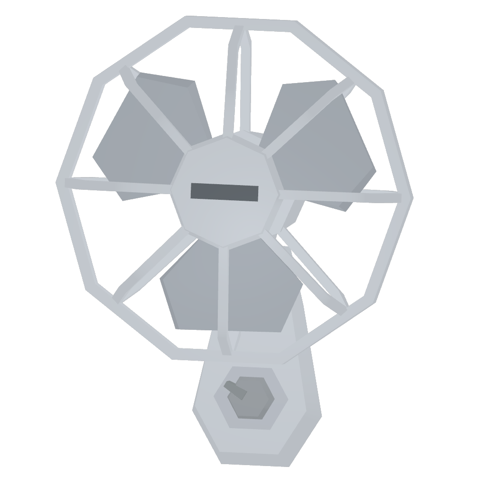

# 🌱 Drugs

| Item                                                                                                                          | Info                            | Price |
| ----------------------------------------------------------------------------------------------------------------------------- | ------------------------------- | ----- |
| 
Amnesia Haze 15100
                     | A weed seed                     |       |
| 
A. Haze Bag Small  15103
     | A small bag of weed             |       |
| 
A. Haze Bag Medium

15104
 | A medium bag of weed            |       |
| 
A. Haze Bag Large 15105
      | A large bag of weed             |       |
| 
A. Haze Joint 15106
                    | A weed joint                    |       |
| 
Fan  15410
                                    | A barricade to boost your crop. |       |
| 
Light  15420
                                | A barricade to boost your crop. |       |
| 
Chemical #1 15600
                        | Chemicals                       |       |
| 
Chemical #2 15601
                        | Chemicals                       |       |
| 
Chemical #3 15602
                        | Chemicals                       |       |
| 
Chemical #4 15603
                        | Chemicals                       |       |
| 
Chemical #5 15604
                        | Chemicals                       |       |
| 
Chemical #6 15605
                        | Chemicals                       |       |
| 
Burner #1 15400
                            |                                 |       |
| 
Burner #2 15401
                        |                                 |       |
| 
Empty 15500
                                   | A empty Meth tray               |       |
| 
Full  15501
                                    | A Full Meth tray                |       |
| 
Full Cracked 15502
                     | A Full carcked Meth tray        |       |
