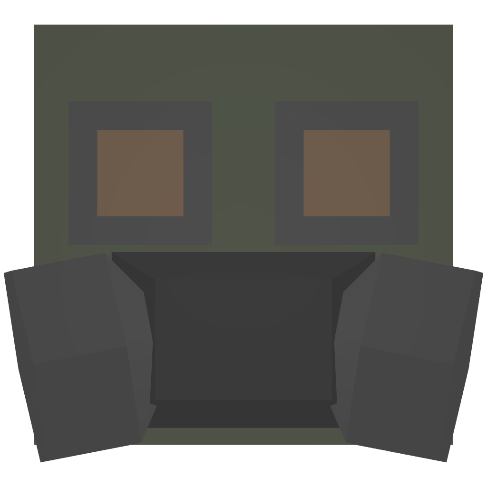
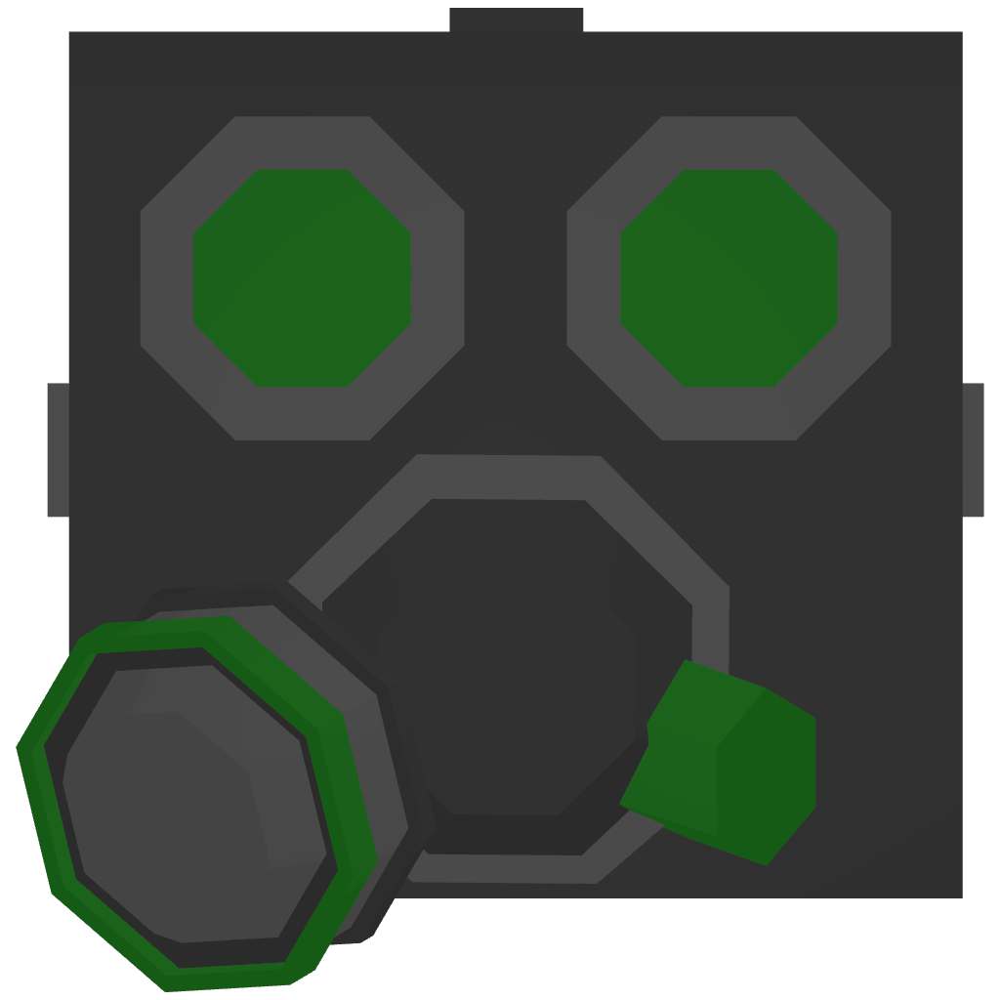
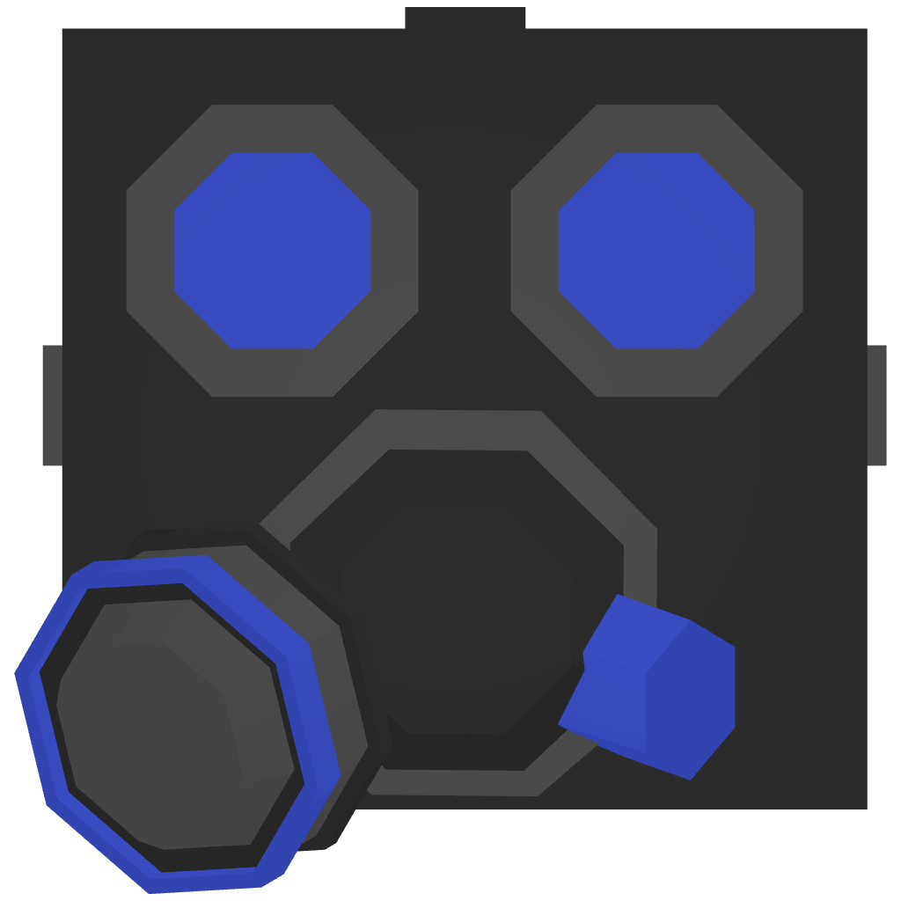

# 😷    Gasmask


<mark style="color:red;background-color:orange;">**WORKING IN PROGRESS**</mark>


1. "Basic Protective Gasmask"
2. "Standard Issue Gasmask"
3. "Advanced Safety Gasmask"
4. "Professional Grade Gasmask"
5. "Elite Series Gasmask"
6. "Ultimate Protection Gasmask"

Upgrade using rubber, silicone and plastic.

For T4 & 5 you need to find a blueprint in Deadzone.\
For Tier 6 you need to be donator and also have a T5 to craft it.\
\
To acquire a T6 item, you must fulfill the following requirements: complete the <mark style="color:red;">**main quest**</mark>, possess the corresponding blueprint, and be a donator to craft it.

<table><thead><tr><th width="175.33333333333331">Name</th><th width="293" data-type="checkbox">Blueprint</th><th data-type="checkbox">Donator</th><th></th></tr></thead><tbody><tr><td> T1 Gasmask</td><td>false</td><td>false</td><td></td></tr><tr><td> T2 Gasmask</td><td>false</td><td>false</td><td></td></tr><tr><td>T3 Gasmask</td><td>false</td><td>false</td><td></td></tr><tr><td> T4 Gasmask</td><td>true</td><td>false</td><td></td></tr><tr><td> T5 Gasmask</td><td>true</td><td>false</td><td></td></tr><tr><td> T6 Gasmask</td><td>true</td><td>true</td><td></td></tr></tbody></table>
