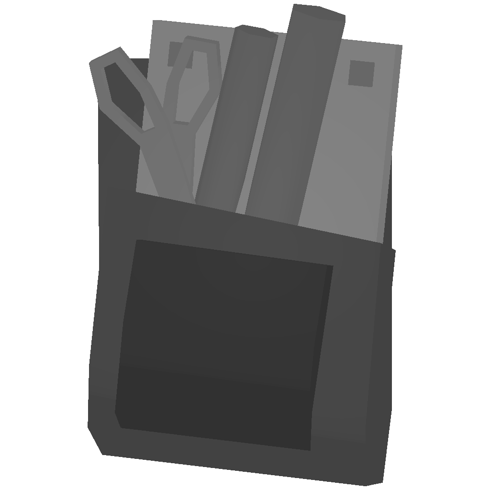

# 🔫 Guns


Weapons ID are not available, you may find them in the workshop or in the files.




Where to get

<table><thead><tr><th width="156.66666666666666">Name</th><th>Info</th><th>Location</th></tr></thead><tbody><tr><td>Police Taser 30016</td><td>Ammo: 1 Range: 15 Damage: 2</td><td>Police kit only</td></tr><tr><td>Police Taser Magazine 30017</td><td>Use to reload Police Taser</td><td>Police kit only</td></tr><tr><td>Sewing Kit 12400</td><td>Use in clothing</td><td>-</td></tr></tbody></table>



