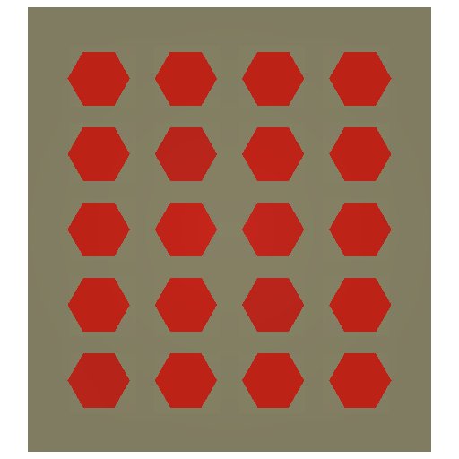
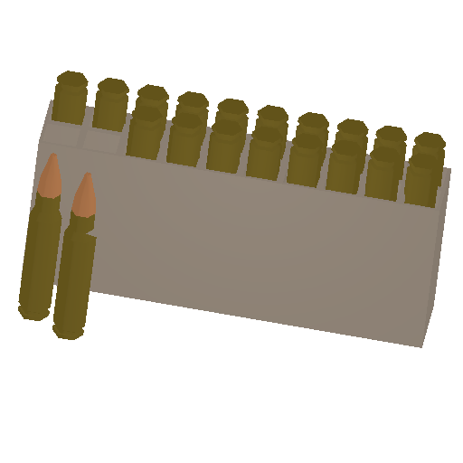
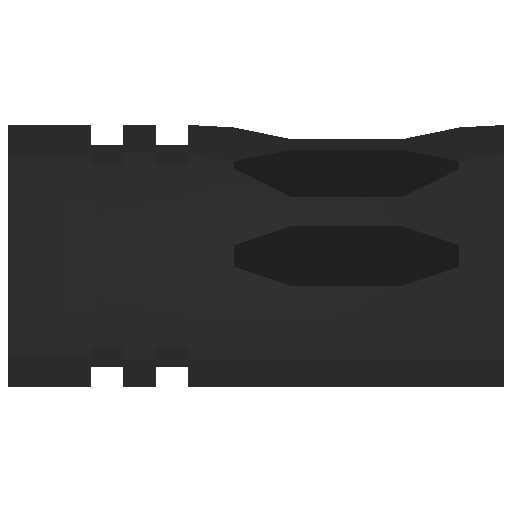

# 🔫 Guns

T.O.C: \
[#utilities](./#utilities "mention")[#ammo](./#ammo "mention")[#barrels](./#barrels "mention")[#grips](./#grips "mention")[#guns](./#guns "mention")[#magazines](./#magazines "mention")[#melee](./#melee "mention")[#sights](./#sights "mention")[#tacticals](./#tacticals "mention")


Weapon's usage n Info will be filled in slowly. Some missing images will be added in after workshop is updated!




Where to get

<table><thead><tr><th width="156.66666666666666">Name</th><th>Info</th><th>Location</th></tr></thead><tbody><tr><td>Police Taser</td><td>Ammo: 1 Range: 15 Damage: 2</td><td>Police kit only</td></tr><tr><td>Police Taser Magazine</td><td>Use to reload Police Taser</td><td>Police kit only</td></tr><tr><td>Sewing Kit</td><td>Use in clothing</td><td>-</td></tr></tbody></table>





| Name                                                                                              | Usage | Info |
| ------------------------------------------------------------------------------------------------- | ----- | ---- |
| 5.45x39                |       |      |
| 5.45x39\_1080EA |       |      |
| 5.56x45                |       |      |
| 5.57x28                |       |      |
| 7.62x25                |       |      |
| 7.62x39                |       |      |
| 7.62x51                |       |      |
| 7.62x54                |       |      |
| 9x18                      |       |      |
| 9x19                      |       |      |
| 9x21                      |       |      |
| 12.7\_AmmoBox     |       |      |
| 12.7x55           |       |      |
| 12.7x99                                                                                           |       |      |
| 12ga                      |       |      |
| 20ga                      |       |      |
| 45\_ACP                 |       |      |
| 300\_BLK               |       |      |
| 338\_lapua           |       |      |
| 357                    |       |      |
| 366\_TKM               |       |      |
| SP9\_Ammobox       |       |      |




<table><thead><tr><th width="460.66666666666663">Name </th><th width="214">Usage</th><th>Info</th></tr></thead><tbody><tr><td>6P20_0-20_5.45x39_Muzzle_Brake&#x26;Compensator 6P26_0-20_5.45x39_Muzzle_Brake&#x26;Compensator PBS-4 RPK-16_muzzle SRVV_5</td><td>5.45x39</td><td></td></tr><tr><td><a href="./#5.56nato_variation">ACR_muzzle</a> AK-101_Muzzle_Brake&#x26;Compensator AK-102_Muzzle_Brake&#x26;Compensator Ferfrans_CQB_5.56x45_Muzzle KAC_flash_hider KAC_QDSS_NT4_black KAC_QDSS_NT4_sand</td><td>5.56x45</td><td></td></tr><tr><td>6P1_0-14_7.62x39_Muzzle_Brake&#x26;Compensator 6P45_0-20_7.62x39_Muzzle_Brake&#x26;Compensator 6P46_0-20_7.62x39_Muzzle_Brake&#x26;Compensator AK-15_muzzle PBS-1</td><td>7.62x39</td><td></td></tr><tr><td>DTK-1</td><td>7.62x39,5.45x39</td><td></td></tr><tr><td>SIG_SRD762TI</td><td>7.62x51</td><td></td></tr><tr><td>bramit_device</td><td>7.62x54</td><td></td></tr><tr><td>pp91__suppressor</td><td>9x18</td><td></td></tr><tr><td>K7_Suppressor MP5SD6_Silencer PP-19-01_Vityaz_Gen2_muzzle Silencerco_Omega9K</td><td>9x19</td><td></td></tr><tr><td>AS-VAL_Silencer VSS_Silencer</td><td>9x39</td><td></td></tr><tr><td>ash_muzzle ash_suppressor</td><td>12.7x55</td><td></td></tr><tr><td>B&#x26;T_ump45_suppressor Silencerco_Omega45K</td><td>45</td><td></td></tr></tbody></table>




<table><thead><tr><th width="279.66666666666663">Name</th><th>Usage</th><th></th></tr></thead><tbody><tr><td>Magpul_AFG</td><td></td><td></td></tr><tr><td>Magpul_RVG</td><td></td><td></td></tr><tr><td>RK-1</td><td></td><td></td></tr><tr><td>RK-2</td><td></td><td></td></tr><tr><td>RK-6</td><td></td><td></td></tr><tr><td>Tangodown_Stubby_Black</td><td></td><td></td></tr><tr><td>Tangodown_Stubby_Tan</td><td></td><td></td></tr></tbody></table>



Window: Ctrl + F (Gun's Name) \
Mac: Command + F (Gun's Name)&#x20;

### 5.56NATO\_Variation

| Name                                                                                       | Usage | Info |
| ------------------------------------------------------------------------------------------ | ----- | ---- |
| ACR                                               |       |      |
| Colt M4A1                                  |       |      |
| CZ bren 2                                 |       |      |
| Desert Tech MDR 556            |       |      |
| FN SCAR L |       |      |
| FNC             |       |      |
| G36C                                             |       |      |
| G36K                                             |       |      |
| Heckler Koch HK416A5           |       |      |
| K1A                                               |       |      |
| K2                                                 |       |      |
| Molot ADAR 2 15                    |       |      |
| Styer AUG SF                           |       |      |
| Styer AUGA3                              |       |      |

### 5.56NATO\_Variation\_Custom

| Name       | Usage                  | Info                   |
| ---------- | ---------------------- | ---------------------- |
| Colt M4 DD | UNAVAILABLE/ MOD ISSUE | UNAVAILABLE/ MOD ISSUE |

### 7.62NATO\_Variation

| Name                                                                            | Usage | Info |
| ------------------------------------------------------------------------------- | ----- | ---- |
| Desert Tech MDR 308 |       |      |
| DSA SA 58                      |       |      |
| FN SCAR H                      |       |      |
| G3A3                                  |       |      |
| H\&K G28                         |       |      |
| Kel tec RFB                  |       |      |

### 12.7x55

| Name                                                   | Usage | Info |
| ------------------------------------------------------ | ----- | ---- |
| ASH           |       |      |
| RSh-12.7 |       |      |
| VKS           |       |      |

### AK\_Variation

#### 5.45x39

| Name                                                                    | Usage | Info |
| ----------------------------------------------------------------------- | ----- | ---- |
| 6P20 AK-74             |       |      |
| 6P20N AK-74N         |       |      |
| 6P21 AKS-74           |       |      |
| .png>)6P21N AKS-74N |       |      |
| .png>)6P26 AKS-74U   |       |      |
| 6P26N AKS-74UN     |       |      |
| 6P34 AK-74M           |       |      |
| 6P47 AK-105           |       |      |
| AK-12                        |       |      |
| RPK-16                      |       |      |
| SAG-545                    |       |      |

#### 5.56x45

| Name                                                          | Usage | Info |
| ------------------------------------------------------------- | ----- | ---- |
| 6P43 AK-101 |       |      |
| 6P44 AK-102 |       |      |
| AK-19              |       |      |
| Wz 2004         |       |      |

#### 7.62x39

| Name                                                                       | Usage | Info |
| -------------------------------------------------------------------------- | ----- | ---- |
| 6P1 AKM                      |       |      |
| 6P1N AKMN                  |       |      |
| 6P4 AKMS                    |       |      |
| 6P4N AKMSN                |       |      |
| 6P45 AK-103              |       |      |
| 6P46 AK-104              |       |      |
| AK-15                           |       |      |
| CSA Vz.58 Carbine |       |      |
| CSA Vz.58 Shorty   |       |      |
| MK47                             |       |      |
| RD-704                         |       |      |
| RPK                               |       |      |
| RPKN                             |       |      |
| WAC-47                         |       |      |

#### 7.62x51

| Name                                             | Usage | Info |
| ------------------------------------------------ | ----- | ---- |
| AK308 |       |      |

### LMG

| Name                                                           | Usage | Info |
| -------------------------------------------------------------- | ----- | ---- |
| FN M249 MK2 |       |      |
| RPD                   |       |      |

### PDW

<table><thead><tr><th width="226.66666666666666">Name</th><th>Usage</th><th>Info</th></tr></thead><tbody><tr><td>6P29 TsNIITochMash VSS Vintorez</td><td></td><td></td></tr><tr><td>6P29M TsNIITochMash VSS M</td><td>UNAVAILABLE/ MOD ISSUE</td><td>UNAVAILABLE/ MOD ISSUE</td></tr><tr><td>6P30 TsNIITochMash AS_VAL</td><td></td><td></td></tr><tr><td>FN_P90</td><td></td><td></td></tr><tr><td>SIG MCX Keymod 300Blackout</td><td></td><td></td></tr></tbody></table>

### Pistol

| Name                                                                           | Usage | Info |
| ------------------------------------------------------------------------------ | ----- | ---- |
| APS Stechkin                |       |      |
| Beretta M9A3                |       |      |
| Chiappa Rhino 50DS   |       |      |
| Colt M45a1                    |       |      |
| Colt\_M1911                   |       |      |
| FN57                                 |       |      |
| .png>)Glock17                     |       |      |
| Glock18C                         |       |      |
| Glock19X                         |       |      |
| HK USP                            |       |      |
| .png>)Makarov PB              |       |      |
| Makarov PM                    |       |      |
| SIG P226R                      |       |      |
| SR-1MP Gyurza              |       |      |
| TT33                                 |       |      |
| Yarygin MP443 Grach |       |      |

### Saiga\_Variation

|                                                          |   |   |
| -------------------------------------------------------- | - | - |
| PP 19 01 |   |   |
| Saiga 9    |   |   |
| Saiga 12  |   |   |

### Shotgun

| Name                                                                                                                     | Usage | Info |
| ------------------------------------------------------------------------------------------------------------------------ | ----- | ---- |
| Benelli M1014                                                        |       |      |
| MolotBekas                                                               |       |      |
| Mossberg 590A1                                                      |       |      |
| MP-18M                                                                       |       |      |
| MP-43-1C                                                                   |       |      |
| MP-133 Pump-Action Shotgun                             |       |      |
| MP-153\_Semi-Automatic\_Shotgun                     |       |      |
| MTS-255                                                                     |       |      |
| Remington Model 870 Pump-Action Shotgun |       |      |
| Toz\_KS-23M\_Pump-Action\_Carbine                 |       |      |
| Toz-106 Bolt-Action Shotgun                           |       |      |

### SMG

| Name                                                                                       | Usage | Info |
| ------------------------------------------------------------------------------------------ | ----- | ---- |
| .png>)Heckler\&Koch MP5 Kurz |       |      |
| Heckler\&Koch MP5A4              |       |      |
| Heckler\&Koch MP5SD6            |       |      |
| Heckler\&Koch UMP45              |       |      |
| K7                                                 |       |      |
| MP9                                               |       |      |
| MP9N                                             |       |      |
| PPSh-41                                       |       |      |
| SIG MPX                                      |       |      |
| SR-2                                             |       |      |
| Vector 9mm                                |       |      |
| Vector 45mm                              |       |      |
| ZMZ PP-91 Kedr                       |       |      |

Sniper

|                                                                     |   |   |
| ------------------------------------------------------------------- | - | - |
| AWM                        |   |   |
| DVL                        |   |   |
| DVL Suppressed |   |   |
| M700                      |   |   |
| .png>)Mosin              |   |   |
| Mosin.Inf Carbine        |   |   |
| Mosin Infantry |   |   |
| Mosin Obrez       |   |   |
| SKS                        |   |   |
| SKS OP                 |   |   |
| SV98                      |   |   |
| SVD                        |   |   |
| SVDS                      |   |   |

### Vepr\_Civilian

| Name                                                                   | Usage | Info |
| ---------------------------------------------------------------------- | ----- | ---- |
| Vepr 101 Hunter |       |      |
| Vepr 136                |       |      |
| Vepr 209                |       |      |
| .png>)Vepr 215          |       |      |



### 5.56\_NATO

<table><thead><tr><th width="165.66666666666666">Name</th><th>Usage</th><th>Info</th></tr></thead><tbody><tr><td>5.56x45 M249 200-round Mag</td><td></td><td></td></tr><tr><td>5.56x45 Magpul PMAG Gen M3 10-round Mag</td><td></td><td></td></tr><tr><td>5.56x45 Magpul_PMAG Gen M3 20-round Mag</td><td></td><td></td></tr><tr><td>5.56x45 Magpul PMAG Gen M3 40-round Mag</td><td></td><td></td></tr><tr><td>5.56x45 PMAG D 60-round Mag</td><td></td><td></td></tr><tr><td>5.56x45 PMAG Gen M3 30-round Mag</td><td></td><td></td></tr><tr><td>5.56x45 STANAG 30-round Mag</td><td></td><td></td></tr><tr><td>5.56x45 Surefire MAG5 60-round Mag</td><td></td><td></td></tr><tr><td>5.56x45 Surefire MAG5 100-round Mag</td><td></td><td></td></tr><tr><td>AUG 5.56x45mm 30rnd PMAG</td><td></td><td></td></tr><tr><td>AUG 5.56x45mm Polymer 30rnd Mag</td><td></td><td></td></tr><tr><td>AUG 5.56x45mm Polymer 42rnd Mag</td><td></td><td></td></tr><tr><td>G36 30-round Mag</td><td></td><td></td></tr></tbody></table>

### 7.62\_NATO

| Name                                                                                                                              | Usage | Info |
| --------------------------------------------------------------------------------------------------------------------------------- | ----- | ---- |
| 7.62x51 PMAG SR-LR GEN M3 20rnd Mag                |       |      |
| 7.62x51 VPO101 10-round Mag                                  |       |      |
| FAL 7.62x51 20-round Mag                                         |       |      |
| FAL 7.62x51 30-round Mag                                                                                                          |       |      |
| FN SCAR-H 7.62x51 20-round Mag FDE                   |       |      |
| G28 7.62x51 20-round Mag                                         |       |      |
| M700 7.62x51 ProMag AA-70 10-round magazine |       |      |
| RPD 100rnd Mag                                                              |       |      |
| X-FAL 7.62x51 50-round Drum Mag                                                                                                   |       |      |

### 7.62x54R

<table><thead><tr><th width="191">Name</th><th>Usage</th><th>Info</th></tr></thead><tbody><tr><td>5 Round 7.62x54R</td><td></td><td></td></tr><tr><td>7.62x54mmR MP18 bullet</td><td></td><td></td></tr><tr><td>7.62x54R 10-round Mag</td><td></td><td></td></tr><tr><td>SV-98 7.62x54R 10-round magazine</td><td></td><td></td></tr></tbody></table>

### 12.7x55

| Name                                                                  | Usage | Info |
| --------------------------------------------------------------------- | ----- | ---- |
| .png>)12.7x55 5rnd |       |      |
| ASH 10mag             |       |      |
| ASH 20mag             |       |      |
| VSK mag                 |       |      |

### AK\_Magazine

#### 5.45x39

<table><thead><tr><th width="202.66666666666666">Name</th><th>Usage</th><th>Info</th></tr></thead><tbody><tr><td>5.45x39 PMAG AK GEN3 30-round Mag</td><td></td><td></td></tr><tr><td>5.45x39 PMAG Gen M3 30-round Mag</td><td></td><td></td></tr><tr><td>5.45x39 RPK-16 Drum 95-round Mag</td><td></td><td></td></tr><tr><td>6L18 5.45x39 45-round Mag</td><td></td><td></td></tr><tr><td>6L20 Bakelite 5.45x39 30-round Mag</td><td></td><td></td></tr><tr><td>6L23 5.45x39 30-round Polymer Mag</td><td></td><td></td></tr><tr><td>6L26 5.45x39 45-round Mag</td><td></td><td></td></tr><tr><td>60rnd 6L31 Maganzine</td><td></td><td></td></tr><tr><td>AK-12 5.45x39 polymer 30rds magazine</td><td></td><td></td></tr></tbody></table>

#### 5.56x45

<table><thead><tr><th width="160.66666666666666">Name</th><th>Usage</th><th>Info</th></tr></thead><tbody><tr><td>6L29 5.56x45 30-round Mag</td><td></td><td></td></tr></tbody></table>

#### 7.62x39

| Name                                                                                                               | Usage | Info |
| ------------------------------------------------------------------------------------------------------------------ | ----- | ---- |
| 6L10 7.62x39 30-round Mag                        |       |      |
| 6P2.sb-11 Molot 7.62x39 40-round Mag |       |      |
| 7.62x39 30round polymag                             |       |      |
| 7.62x39 AK ribbed 10-round Mag             |       |      |
| 7.62x39 AK-103 30-round Mag                    |       |      |
| 7.62x39 Molot Durm 75-round Mag           |       |      |
| 7.62x39 PMAG Gen M3 30-round Mag        |       |      |
| 7.62x39 X47 Durm 50-round Mag               |       |      |
| AK55 7.62x39 30-round Mag                        |       |      |
| AR-15 7.62x39 30-round Mag                      |       |      |

#### 7.62x51

| Name                                                      | Usage | Info |
| --------------------------------------------------------- | ----- | ---- |
| AK308 mag |       |      |

### Assault\_Carbine

| Name                                                                       | Usage | Info |
| -------------------------------------------------------------------------- | ----- | ---- |
| 4-rnd vpo-192 mag |       |      |
| 10-round SKS            |       |      |

### PDW

| Name                                                                                            | Usage | Info |
| ----------------------------------------------------------------------------------------------- | ----- | ---- |
| 6L24 10round Maganzine            |       |      |
| 6L25 20round Magazine              |       |      |
| 300 Blackout PMAG Gen.3         |       |      |
| FN P90 5.7x28 50-round Mag |       |      |
| SR3M.130 30round magazine      |       |      |

### Pistol

| Name                                                                                                 | Usage | Info |
| ---------------------------------------------------------------------------------------------------- | ----- | ---- |
| 6P53 SR-1MP 9x21 18-round Mag |       |      |
| 9x18PM 90-03 8-round Mag            |       |      |
| 9x18PM Aps 20-round Mag              |       |      |
| 9x19 M9A3 17-round Mag                |       |      |
| 9x19 MP-443 18-round Mag            |       |      |
| 45acp M1911A1 7-round Mag          |       |      |
| 45acp USP45 12-round Mag            |       |      |
| .png>)357 Magnum Speed Loader        |       |      |
| FN Mag                                                  |       |      |
| Glock 9x19 17-round Mag              |       |      |
| Glock 9x19 33-round Mag              |       |      |
| Glock 45ACP 30-round Mag            |       |      |
| SIG 9x19 P226R 15-round Mag     |       |      |
| TT 7.62x25 tt-105 8-round Mag |       |      |

### Shotgun

| Name                                                                                                       | Usage | Info |
| ---------------------------------------------------------------------------------------------------------- | ----- | ---- |
| 2-shot MC 20-01 sb.3 20ga Mag     |       |      |
| 12 Gauge 2-round                                   |       |      |
| 12 Gauge 5-round                                   |       |      |
| 12 Gauge 6-round                                   |       |      |
| 23x75mm 4-round Shell                         |       |      |
| .png>)366tkm AK ribbed 10-round Mag |       |      |
| SAIGA-12 5rnd                                          |       |      |

### SMG

| Name                                                                                                  | Usage | Info |
| ----------------------------------------------------------------------------------------------------- | ----- | ---- |
| 7.62x25mm 35-round PPSh-41 Mag |       |      |
| 7.62x25mm 71-round PPSh-41 Mag |       |      |
| 9x18PM PP-91 30-round Mag           |       |      |
| 9x19\_B\&T 30rds Mag                      |       |      |
| 9x19 MP5 20-round Mag                   |       |      |
| 9x19 MP5 30-round Mag                   |       |      |
| 9x19 MP5 50-round Mag                   |       |      |
| 9x19 MPX 20-round Mag                   |       |      |
| 9x19 MPX 30-round Mag                   |       |      |
| 9x19 MPX 50-round Mag                   |       |      |
| 9x19 Uzi 30-round Mag                   |       |      |
| 9x21 SR-2 30-round Mag                 |       |      |
| 45acp UMP 25-round Mag                 |       |      |
| PP19-01 Vityaz Mag                          |       |      |

### Sniper

| Name                                                        | Usage | Info |
| ----------------------------------------------------------- | ----- | ---- |
| .png>)AWM 338 |       |      |
| DVL 300       |       |      |




T.O.C: \
[#utilities](./#utilities "mention")[#ammo](./#ammo "mention")[#barrels](./#barrels "mention")[#grips](./#grips "mention")[#guns](./#guns "mention")[#magazines](./#magazines "mention")[#melee](./#melee "mention")[#sights](./#sights "mention")[#tacticals](./#tacticals "mention")




| Name                                                                                          | Usage | Info |
| --------------------------------------------------------------------------------------------- | ----- | ---- |
| 6Kh5 AK74 bayonet                    |       |      |
| Axebar                                            |       |      |
| Bars A-2607 95x18 knife       |       |      |
| Bars A-2607 Damascus knife |       |      |
| BearG Gerber knife                  |       |      |
| KIBA Tactical Tomahawk          |       |      |
| MPL-50 Entrenching Tool        |       |      |
| Tapanga                                          |       |      |
| UVSR Taiga-1                               |       |      |




| Name                                                                                                                            | Usage | Info |
| ------------------------------------------------------------------------------------------------------------------------------- | ----- | ---- |
| 1P69                                                                                  |       |      |
| 1P78-1                                                                              |       |      |
| 1P87                                                                                  |       |      |
| ACOG\_TA31                                                                      |       |      |
| ADAR\_2-15\_Ironsight                                                |       |      |
| .png>)Aimpoint\_ACRO                                                        |       |      |
| Aimpoint\_Micro\_H2                                                    |       |      |
| AUG\_SF\_Scope                                                              |       |      |
| BelOMO\_PK\_AA                                                              |       |      |
| BelOMO\_PK-06                                                                |       |      |
| Colt M4A1 Ironsight                                                  |       |      |
| EKP Kobra                                                                       |       |      |
| ELCAN specterDR 1x 4x                                             |       |      |
| 

Eotech vudu
                                         |       |      |
| Eotech XPS                                                                     |       |      |
| \_30901.png)Eotech XPS(Tan)                                                         |       |      |
| Geissele Super Precision                                        |       |      |
| Krechet                                                                            |       |      |
| .png>)Leupold Mark4 HAMR                                              |       |      |
| Monstrum Tactical Compact Prism Scope 2x32 |       |      |
| NPZ PK1 Obzor                                                              |       |      |
| OKP-7                                                                                |       |      |
| PSO-1                                                                                |       |      |
| pu 3.5x                                                                           |       |      |
| SCAR Ironsight                                                             |       |      |
| SIG BRAVO4                                                                     |       |      |
| SIG ROMEO4                                                                     |       |      |
| Trijicon RMR                                                                 |       |      |
| Trijicon SRS-02                                                           |       |      |




Not Available


