# Attachment



Suppressor

| Names                                                                                         | Info | Recipe |
| --------------------------------------------------------------------------------------------- | ---- | ------ |
| 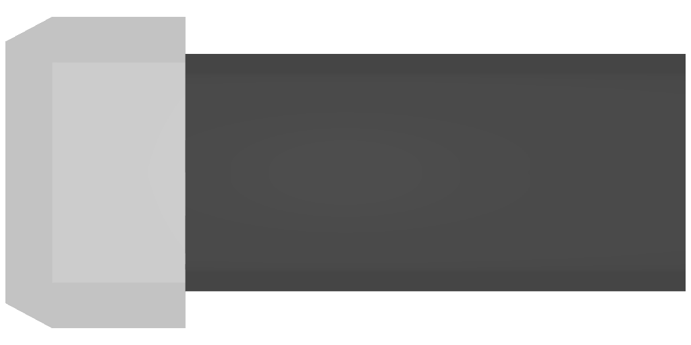T1 Suppressor |      |        |
| 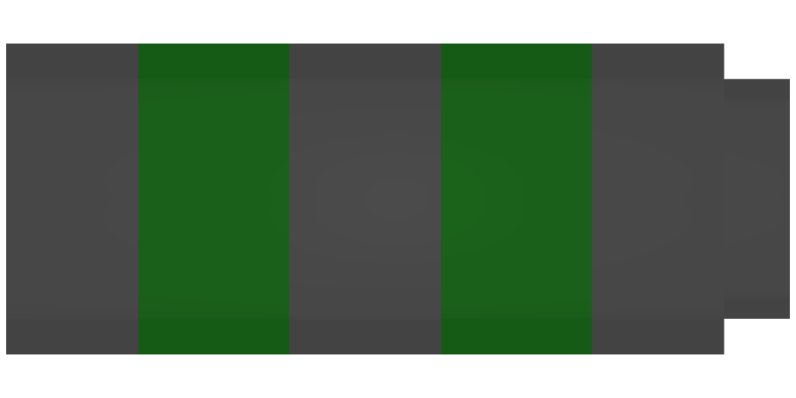T2 Suppressor |      |        |
| 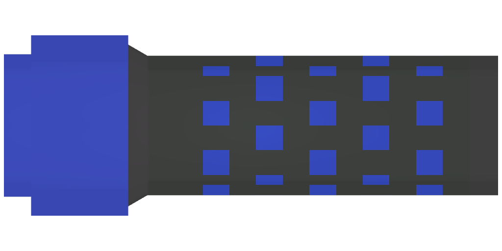T3 Suppressor |      |        |
| T4 Suppressor |      |        |
| 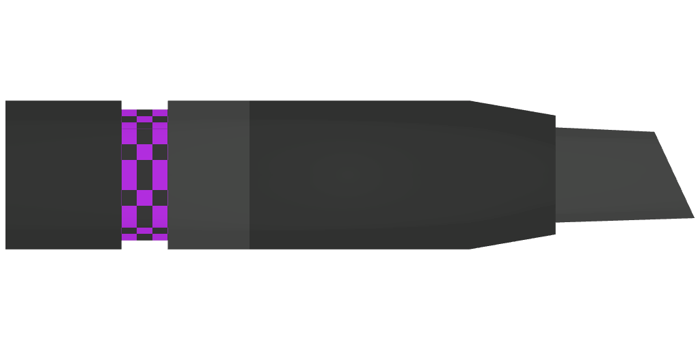T5 Suppressor |      |        |
| 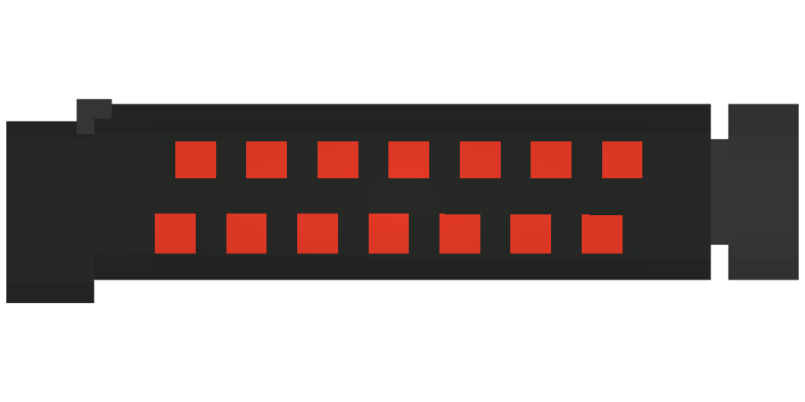T6 Suppressor |      |        |

NightVision

1. "Basic Night Vision"
2. "Standard Night Vision"
3. "Advanced Night Vision"
4. "Professional Night Vision"
5. "Elite Night Vision"
6. "Ultimate Night Vision"

Upgrade using plastics, some metal?, glass.\
Fog intensity : Intensity of fog while nightvision is active

<table><thead><tr><th>Names</th><th width="102" data-type="checkbox">Blueprint</th><th width="94" data-type="checkbox">Donator</th><th>Fog intensity</th><th>Recipe</th></tr></thead><tbody><tr><td>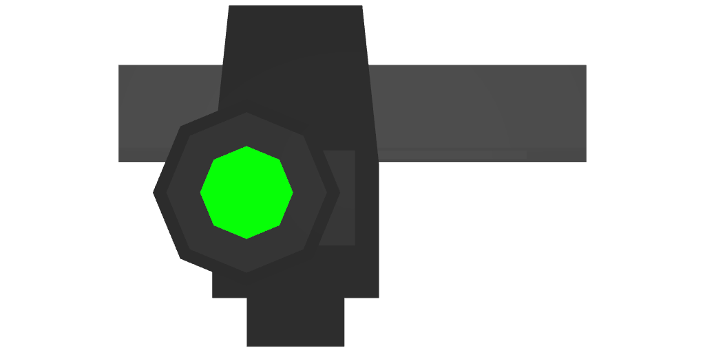T1 NV</td><td>false</td><td>false</td><td>1</td><td></td></tr><tr><td>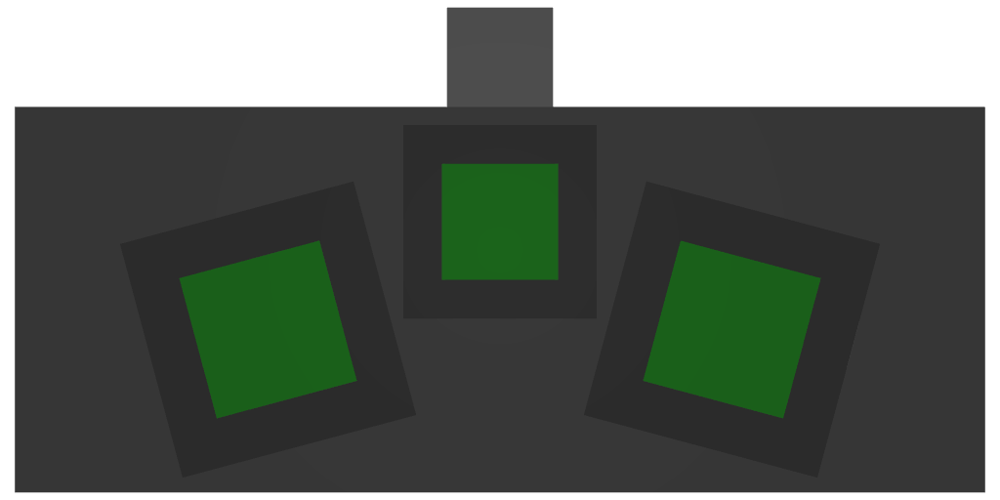T2 NV</td><td>false</td><td>false</td><td>0.9</td><td></td></tr><tr><td>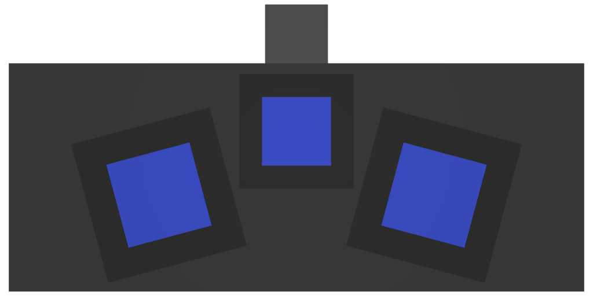T3 NV</td><td>false</td><td>false</td><td>0.8</td><td></td></tr><tr><td>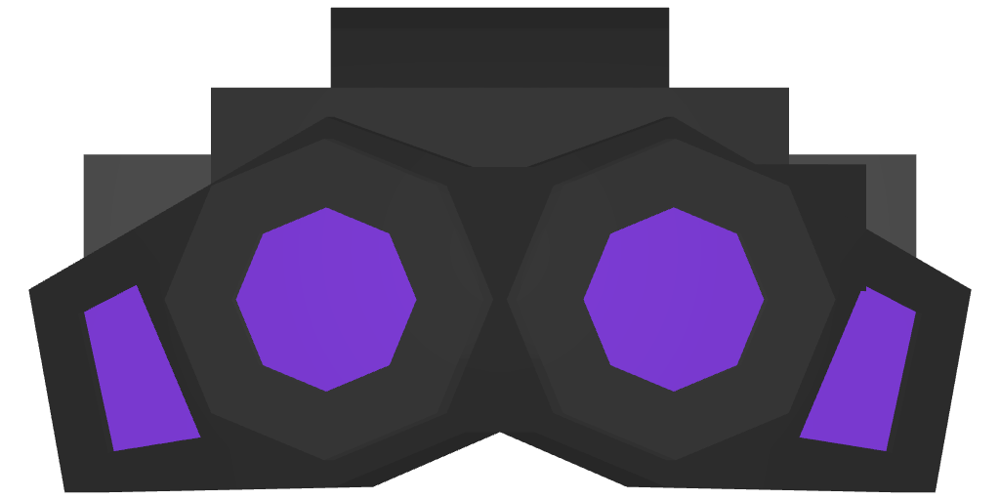T4 NV</td><td>true</td><td>false</td><td>0.7</td><td></td></tr><tr><td>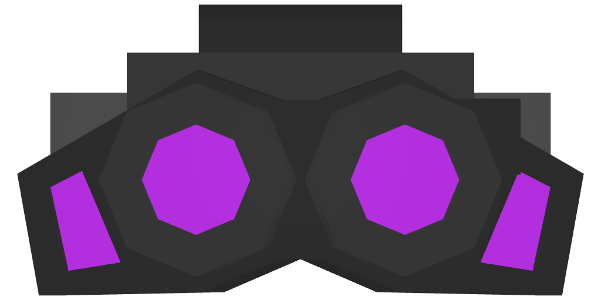T5 NV</td><td>true</td><td>false</td><td>0.6</td><td></td></tr><tr><td>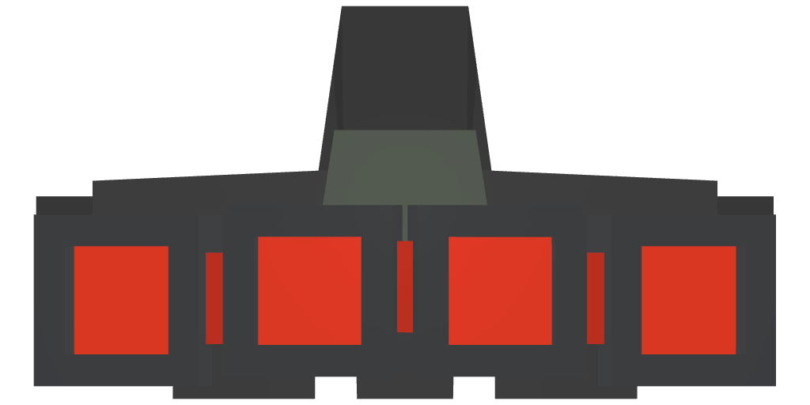T6 NV</td><td>false</td><td>true</td><td>0.5</td><td></td></tr></tbody></table>











