# 💰 Money


<mark style="color:red;background-color:orange;">**WORKING IN PROGRESS**</mark>\ <mark style="color:red;background-color:orange;">**All info shown here will be change when the new update comes.**</mark>


Coins: \
\- You can upgrade coins to a higher tier. \
\- Coins can be use in upgrading items e.g. Pickaxe, Axe, Hammer and much more.



| Name (1x)                                                                         | Name (10x)                                                                         | Name (100x)                                                                         |
| --------------------------------------------------------------------------------- | ---------------------------------------------------------------------------------- | ----------------------------------------------------------------------------------- |
| 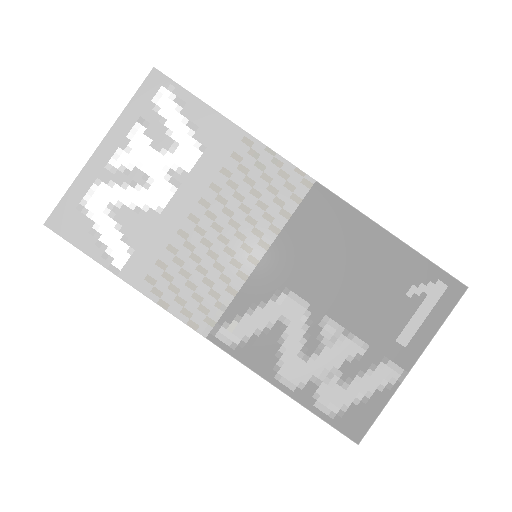1x $1     | 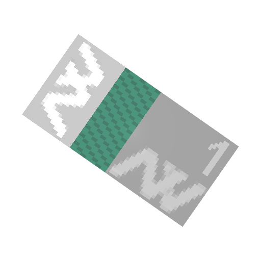10x $1     | 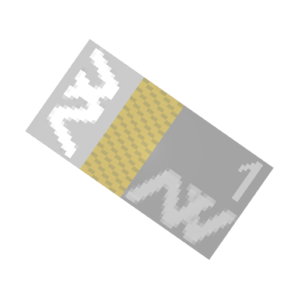100x $1     |
| 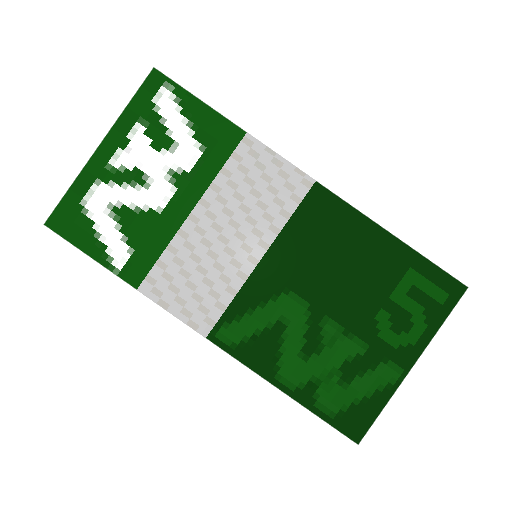1x $5     | 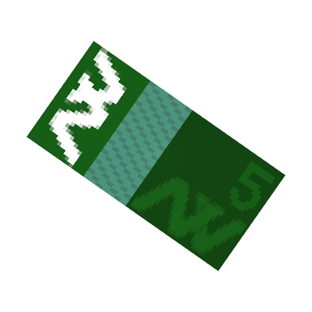10x $5     | 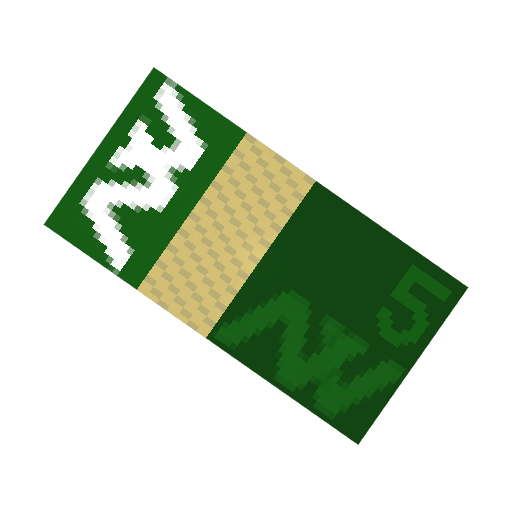100x $5     |
| 1x $10   | 10x $10   | 100x $10   |
| 1x $50   | 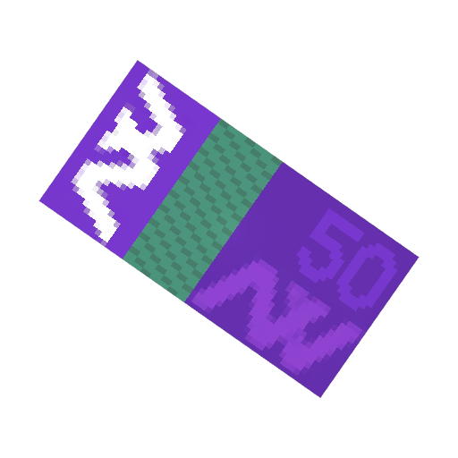10x $50   | 100x $50   |
| 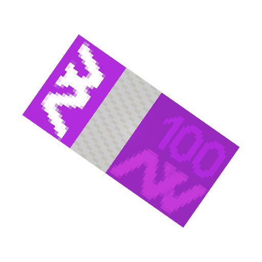1x $100 | 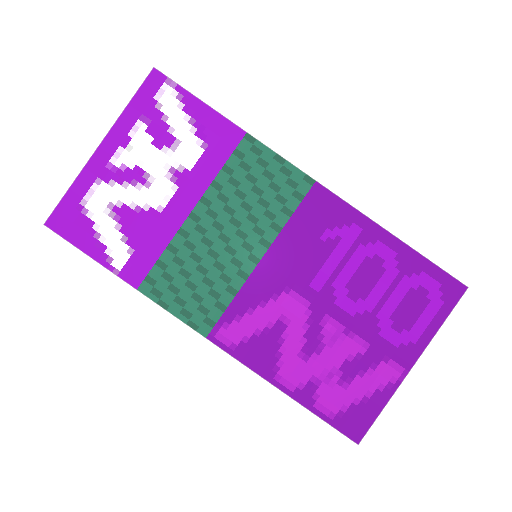10x $100 | 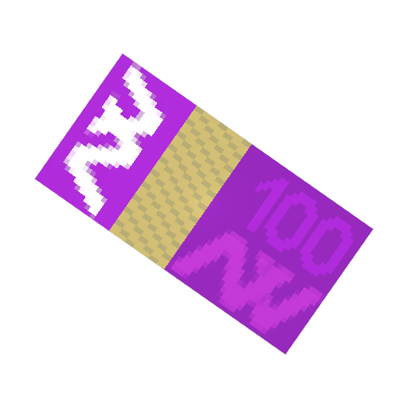100x $100 |
| 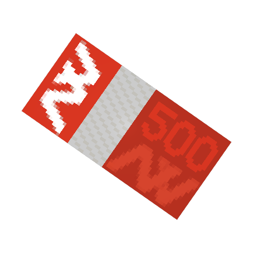1x $500 | 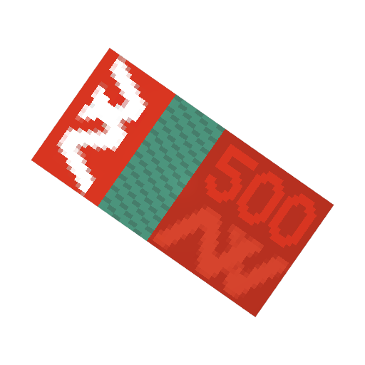10x $500 | 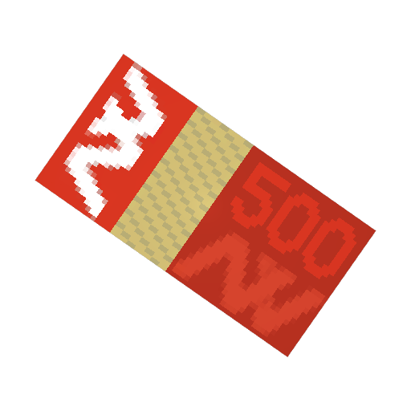100x $500 |




<table><thead><tr><th width="157.66666666666666">Name</th><th>Info</th><th>Obtain</th></tr></thead><tbody><tr><td>Bronze Coin</td><td></td><td>Any resources/ NPC</td></tr><tr><td>Silver Coin</td><td></td><td>Any resources/ NPC</td></tr><tr><td>Gold Coin</td><td></td><td>Any resources/ NPC</td></tr><tr><td>Diamond Coin</td><td></td><td>Any resources/ NPC</td></tr></tbody></table>



