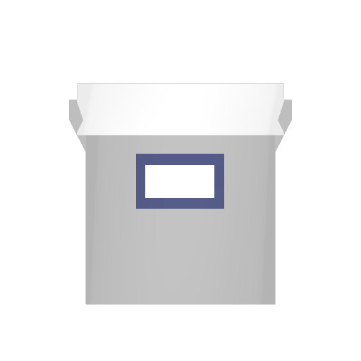
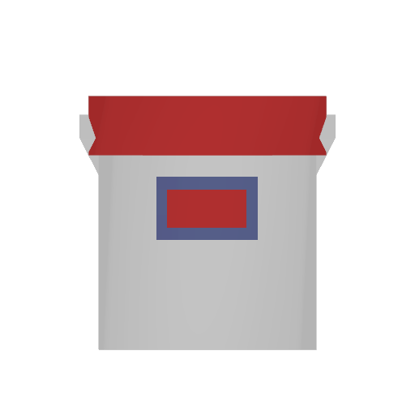
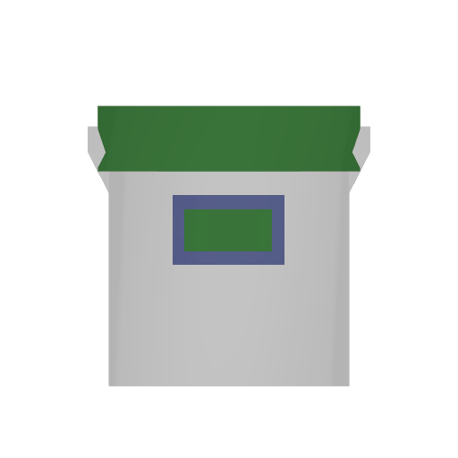
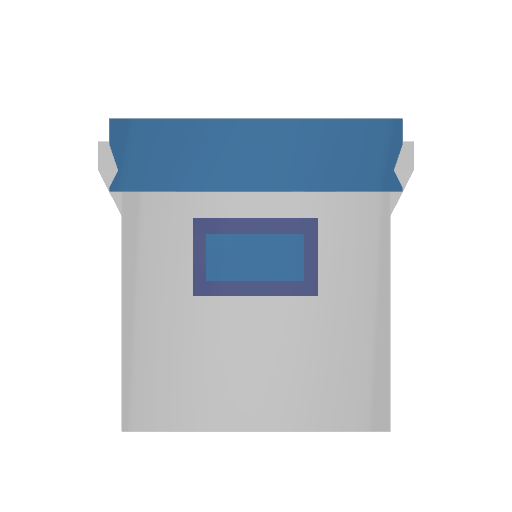
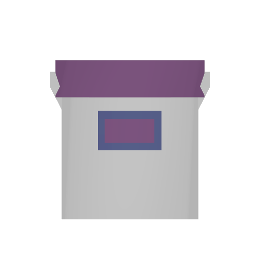
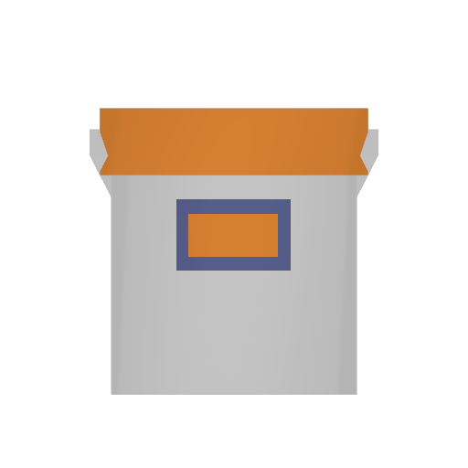
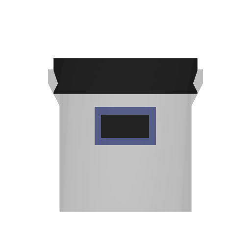

# 🎨 Paint Buckets

Used for: \
\- changing colour of T6 night vision \
\- change clothing colour

<table><thead><tr><th width="142.33333333333331">Name</th><th>How to Obtain</th><th></th></tr></thead><tbody><tr><td>White</td><td>N/A</td><td></td></tr><tr><td>Red</td><td>N/A</td><td></td></tr><tr><td>Green</td><td>N/A</td><td></td></tr><tr><td>Blue</td><td>N/A</td><td></td></tr><tr><td>Purple</td><td>N/A</td><td></td></tr><tr><td>Yellow</td><td>N/A</td><td></td></tr><tr><td>Orange</td><td>N/A</td><td></td></tr><tr><td>Black</td><td>N/A</td><td></td></tr></tbody></table>
