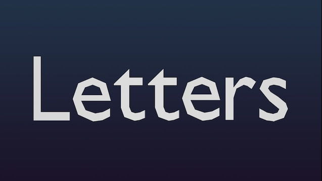

# 📂 Server Mods


IF you ran into a error like this , follow these steps:\
Close your game, Return to steam, Unturned\
Right click, Properties, Verify intergrity of game files.


Northwich Main Mod

[https://steamcommunity.com/sharedfiles/filedetails/?id=2995576162](https://steamcommunity.com/sharedfiles/filedetails/?id=2995576162)

Mod Requires: [City Expansion](https://steamcommunity.com/workshop/filedetails/?id=1835889097), [City Expansion 2](https://steamcommunity.com/workshop/filedetails/?id=1935236838), [Just Letters](https://steamcommunity.com/workshop/filedetails/?id=2351854662), [Northwich NPCs](https://steamcommunity.com/workshop/filedetails/?id=2989216558), [NorthwichRP](https://steamcommunity.com/workshop/filedetails/?id=2919188569), [Objects from all Curated Projects! 6250 Objects! 15/3/2023 UPDATE](https://steamcommunity.com/workshop/filedetails/?id=2899489911), [Road Expansion](https://steamcommunity.com/workshop/filedetails/?id=1771005393), [Vanilla Vehicles 3](https://steamcommunity.com/workshop/filedetails/?id=2726825602), [Vanilla Vehicles Legacy](https://steamcommunity.com/workshop/filedetails/?id=2907647264), [Resources from all Curated Assets! Trees, Foliage & Materials!](https://steamcommunity.com/workshop/filedetails/?id=2941229986), [Simple Doors & Keys Mod](https://steamcommunity.com/workshop/filedetails/?id=2887839342), [\[MILITARY & MORE!\] Large N' Lazy Object Pack | V 1.0.5](https://steamcommunity.com/workshop/filedetails/?id=2812497760)

NorthwichRP

[https://steamcommunity.com/sharedfiles/filedetails/?id=2919188569](https://steamcommunity.com/sharedfiles/filedetails/?id=2919188569)

Modpack will be whitelisted only for the Northwich RP server in the future. Using items from here might only cause you complications in the future.

Northwich UIs

[https://steamcommunity.com/sharedfiles/filedetails/?id=2995040356](https://steamcommunity.com/sharedfiles/filedetails/?id=2995040356)

Northwich NPCs

[https://steamcommunity.com/sharedfiles/filedetails/?id=2989216558](https://steamcommunity.com/sharedfiles/filedetails/?id=2989216558)

Northwich Guns

[https://steamcommunity.com/sharedfiles/filedetails/?id=3002027819](https://steamcommunity.com/sharedfiles/filedetails/?id=3002027819)

More Farming Mod

[https://steamcommunity.com/sharedfiles/filedetails/?id=1232252658](https://steamcommunity.com/sharedfiles/filedetails/?id=1232252658)\
This is a comprehensive expansion mod which enrich PvE life mainly about farming and housing. New animals and crop seeds will spawn naturally in the official maps (except curated maps). It also has a useful function to help you organize items. Press the subscribe button and restart the game to complete the mod installation.

City Expansion

[https://steamcommunity.com/sharedfiles/filedetails/?id=1835889097](https://steamcommunity.com/sharedfiles/filedetails/?id=1835889097)\
This expansion contains 45 only objects for your cities. The mod is still on progress, so i will be adding some objects each week or month.

City Expansion 2

[https://steamcommunity.com/sharedfiles/filedetails/?id=1935236838](https://steamcommunity.com/sharedfiles/filedetails/?id=1935236838)\
Do not reupload the mod or edit the models without Nardo's permission

Just Letters

[https://steamcommunity.com/sharedfiles/filedetails/?id=2351854662](https://steamcommunity.com/sharedfiles/filedetails/?id=2351854662)\
Objects-letters. Simple. This is Small object type. No collision. Full English alphabet. Black and white colors. Capital and lowercase versions. LODs for optimisation included.\
\
Reupload, side publication or monetization anywhere NOT ALLOWED. This will enforce DMCA takedown from Second Cog's side.

Objects from all Curated Projects! 6250 Objects! 15/3/2023 UPDATE

Ever wanted one _specific_ object from some curated project? Well now you can have almost every single object from curated projects, it is only 150mb, that's not too much compared to the +2,5gb for all curated projects combined.

Road Expansion

[https://steamcommunity.com/sharedfiles/filedetails/?id=1771005393](https://steamcommunity.com/sharedfiles/filedetails/?id=1771005393)\
This mod was created for the people who have difficult making sidewalk and that kind of things.

Vanilla Vehicles 3 

[https://steamcommunity.com/sharedfiles/filedetails/?id=2726825602](https://steamcommunity.com/sharedfiles/filedetails/?id=2726825602)\
More Info on: [vehicle](vehicle/ "mention")

Vanilla Vehicles Legacy 

[https://steamcommunity.com/sharedfiles/filedetails/?id=2907647264](https://steamcommunity.com/sharedfiles/filedetails/?id=2907647264)\
More Info on: [vehicle-old.md](vehicle/vehicle-old.md "mention")

Resources from all Curated Assets! Trees, Foliage &#x26; Materials!

[https://steamcommunity.com/sharedfiles/filedetails/?id=2941229986](https://steamcommunity.com/sharedfiles/filedetails/?id=2941229986)\
This mod has specifically only Trees, Foliage & Materials from across all Curated Projects! Instead of downloading every single mod, you can just use this and cut down the size of mods drastically! There's 209 resources; bushes, trees, metal nodes.

Simple Doors &#x26; Keys Mod

[https://steamcommunity.com/sharedfiles/filedetails/?id=2887839342](https://steamcommunity.com/sharedfiles/filedetails/?id=2887839342)\
A mod for the map-maker.

[MILITARY &#x26; MORE!] Large N' Lazy Object Pack | V 1.0.5

[https://steamcommunity.com/sharedfiles/filedetails/?id=2812497760](https://steamcommunity.com/sharedfiles/filedetails/?id=2812497760)

Now with Large N' Lazy, You can give your maps much more flavor and variety! With over 200+ Ready-to-use buildings of various types, from small homes all the way to massive casinos, you can build many new and interesting locations.

Prison Expansion

[https://steamcommunity.com/sharedfiles/filedetails/?id=2255493841](https://steamcommunity.com/sharedfiles/filedetails/?id=2255493841)

Prision Expansion is one of the newest mods made by me using masterbundle and i'm still making new expansions for the future, so stay tuned and join to our [Discord Server](https://discord.com/invite/rtcWEaF).

Pento's Tactical Apparel

[https://steamcommunity.com/sharedfiles/filedetails/?id=1727733956](https://steamcommunity.com/sharedfiles/filedetails/?id=1727733956)

This mod adds tactical clothes and gear to the game. I made this due to the boring selection of clothing both in the based game and other mods.

Steam Workshop Collection: [Northwich](https://steamcommunity.com/sharedfiles/filedetails/?id=3026038523)

