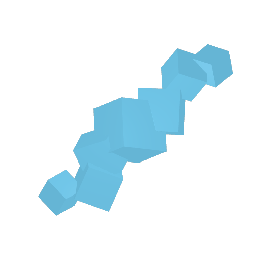
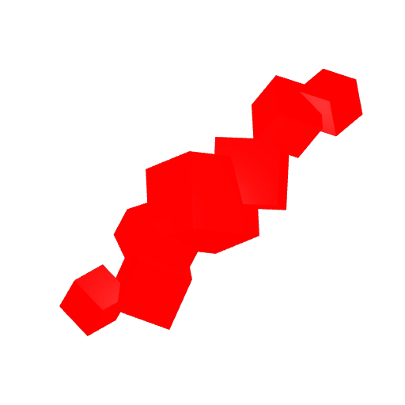

# 🌾 Crops


<mark style="color:red;background-color:orange;">**WORKING IN PROGRESS (information here may be inaccurate)**</mark>




## Berries

| Name                                                                                       | Location / Requirement | Price |
| ------------------------------------------------------------------------------------------ | ---------------------- | ----- |
| Mauve            | Berry Island           |       |
| Amber            | Berry Island           |       |
| Indigo          | Berry Island           |       |
| Jade              | Berry Island           |       |
| Russet          | Berry Island           |       |
| Teal              | Berry Island           |       |
| Vermillion  | Berry Island           |       |
| Obsidian          | Berry Island           |       |
| Lime              |                        |       |
| Crimson            |                        |       |
| Citrine            |                        |       |
| Blush                |                        |       |
| Azure                |                        |       |
| Rose                                                                                       | -                      |       |
| Sapphire                                                                                   | -                      |       |
| Emerald                                                                                    | -                      |       |
| Topaz                                                                                      | -                      |       |
| Ruby                                                                                       | -                      |       |
| Ethereal          | Berry Island           |       |
| Solar                | Berry Island           |       |
| Nebula              | Berry Island           |       |
| Aurora              | Berry Island           |       |
| Inferno            | Berry Island           |       |
| Nirvana            | Berry Island           |       |

#### Rare berries:

"Obsidian" black berries with a dark purple tint "Rose" pink berries with a soft pink tint "Sapphire" blue berries with a deep blue tint "Emerald" green berries with a bright green tint "Topaz" yellow berries with a bright golden tint "Ruby" red berries with a deep red tint

#### Legendary berries:

"<mark style="color:purple;">Ethereal</mark>" purple berries with a shimmering purple aura "Solar" orange berries with a bright yellow aura "Nebula" blue berries with a bright pink aura "Aurora" green berries with a bright multi-colored aura

#### Mythical berries:

"Inferno" red berries with a bright orange aura and a small flame on top "Nirvana" white berries with a radiant aura and a small sparkle on top\




## Farmer Crops

| Name                                                                                     | Location / Requirement | Price |
| ---------------------------------------------------------------------------------------- | ---------------------- | ----- |
| Carrot              |                        |       |
| Corn                  |                        |       |
| Lettuce            |                        |       |
| Potato              |                        |       |
| Pumpkin           |                        |       |
| Tomato              |                        |       |
| Wheat                |                        |       |
| Olives                                                                                   |                        |       |
| Bananas           |                        |       |
| Apples             |                        |       |
| Strawberries  |                        |       |
| Blueberries                                                                              |                        |       |
| Raspberries                                                                              |                        |       |
| Onion                                                                                    |                        |       |
| Watermelon   |                        |       |
| Sugarcane      |                        |       |
| Tobacco                                                                                  |                        |       |
| Sunflowers                                                                               |                        |       |
| Bamboo                                                                                   |                        |       |
| Coffee        |                        |       |
| Orange            |                        |       |
| Cacao              |                        |       |
| Grapes         |                        |       |
| Leek                |                        |       |




