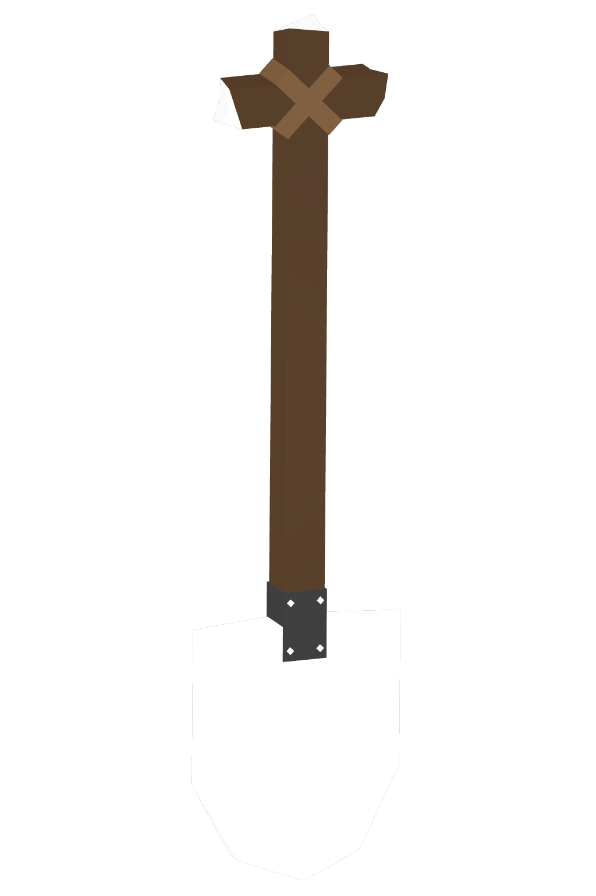
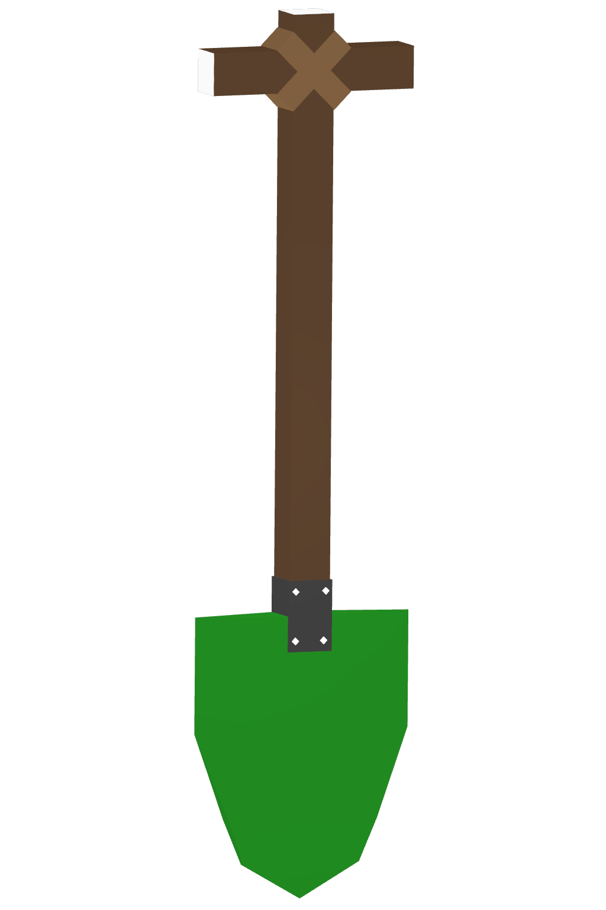
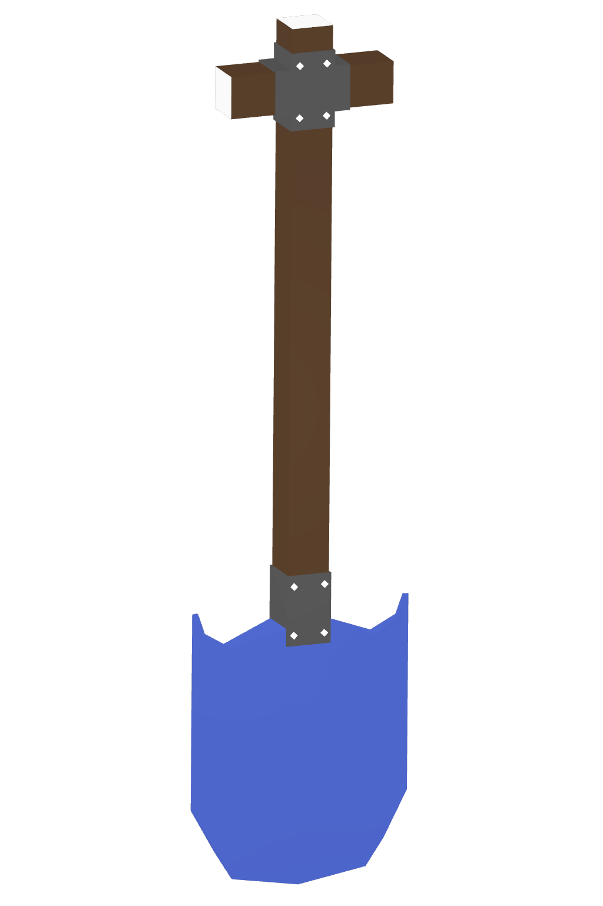
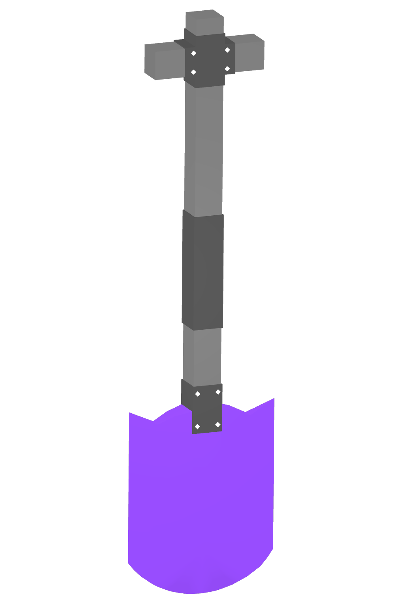
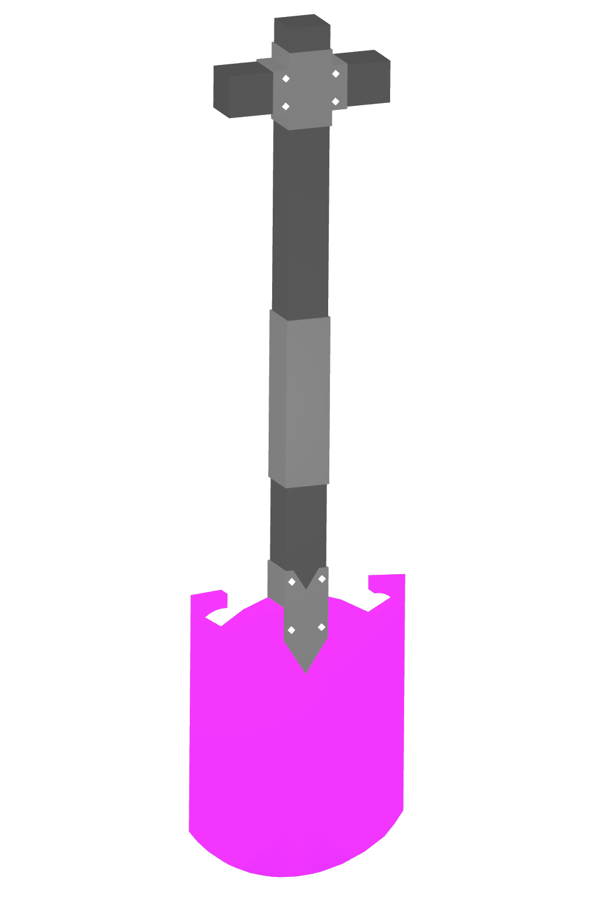
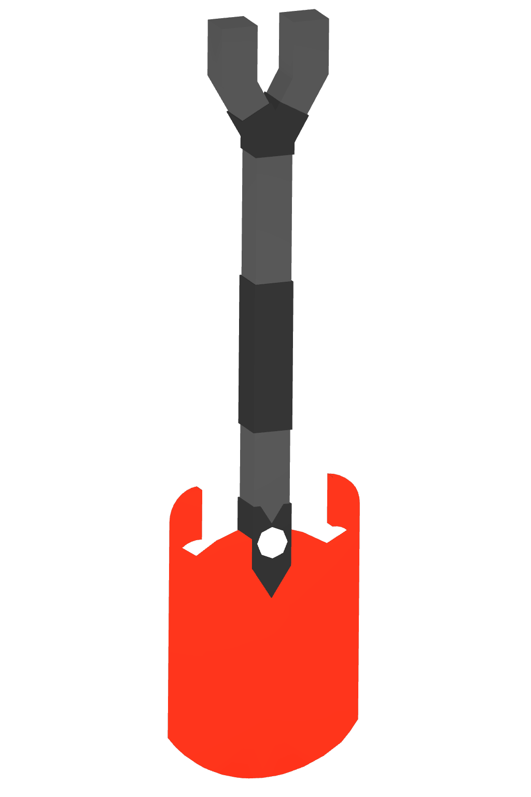
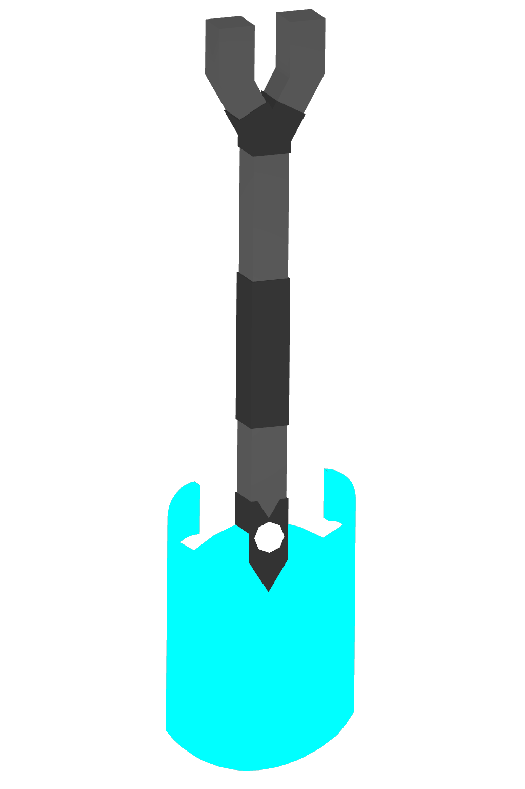

# 🧹 Digging

<table><thead><tr><th width="158">Item</th><th>Info</th><th>Price</th></tr></thead><tbody><tr><td>T1 Shovel</td><td>A shovel for moving loose material such as sand, dirt or clay.</td><td></td></tr><tr><td>T2 Shovel</td><td>A shovel for moving loose material such as sand, dirt or clay.</td><td></td></tr><tr><td>T3 Shovel</td><td>A shovel for moving loose material such as sand, dirt or clay.</td><td></td></tr><tr><td>T4 Shovel</td><td>A shovel for moving loose material such as sand, dirt or clay.</td><td></td></tr><tr><td>T5 Shovel</td><td>A shovel for moving loose material such as sand, dirt or clay.</td><td></td></tr><tr><td>T6 Shovel</td><td>A shovel for moving loose material such as sand, dirt or clay.</td><td></td></tr><tr><td>T7 Shovel</td><td>A shovel for moving loose material such as sand, dirt or clay.</td><td></td></tr></tbody></table>
