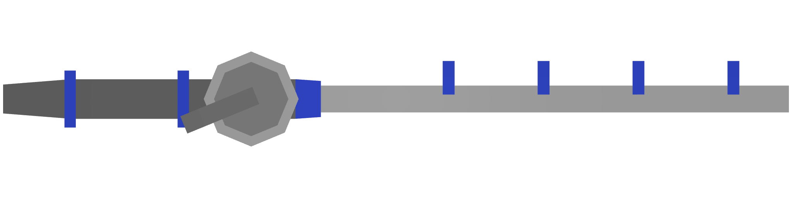
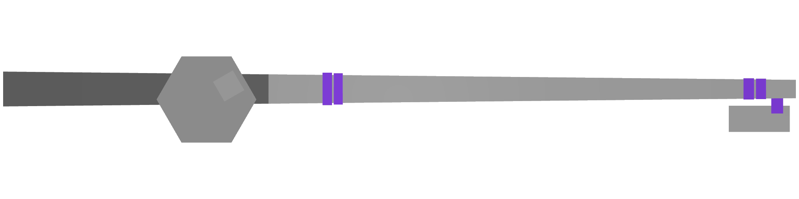
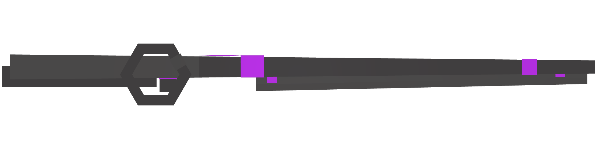
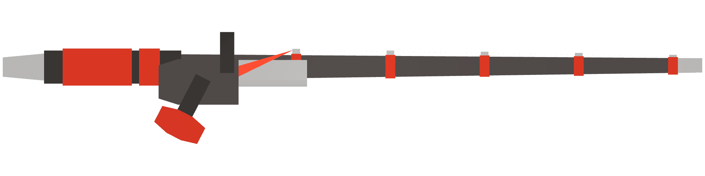
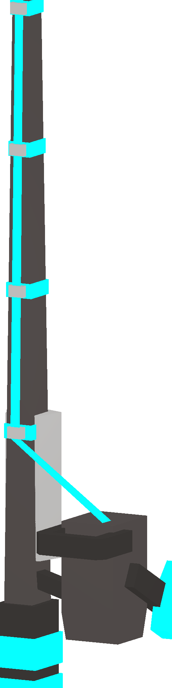

# 🎣 Fishing

To acquire a T6 item, you must fulfill the following requirements: complete the <mark style="color:red;">**main quest**</mark>, possess the corresponding blueprint, and be a donator to craft it.

<table data-view="cards" data-full-width="true"><thead><tr><th>Name</th><th>Reward</th><th>Fishes Image</th><th>Recipe</th><th data-hidden data-card-cover data-type="files"></th></tr></thead><tbody><tr><td> Rod T1 12540</td><td><a href="https://steamcommunity.com/sharedfiles/filedetails/?id=1306955387"><mark style="color:yellow;"><strong>Raw Sardine</strong></mark></a> Probability: 19.8%  🍖10 🧪-10 <a href="https://unturned.fandom.com/wiki/Raw_Goldfish"><mark style="color:yellow;"><strong>Raw Goldfish</strong></mark></a> Probability: 19.8% 🍖10 🧪-10  <a href="https://steamcommunity.com/sharedfiles/filedetails/?id=1306955387"><mark style="color:yellow;"><strong>Raw Shrimp</strong></mark></a> Probability: 19.8%  🍖15 🧪-15 <a href="https://steamcommunity.com/sharedfiles/filedetails/?id=1233954094"><mark style="color:yellow;"><strong>Raw Scallop</strong></mark></a> Probability: 19.8% 🍖15 🧪-15 <a href="https://unturned.fandom.com/wiki/Raw_Minnow"><mark style="color:yellow;"><strong>Raw Minnow</strong></mark></a> Probability: 19.8%  🍖15 🧪-15</td><td></td><td>Available At NPC</td><td></td></tr><tr><td> Rod T2 12541</td><td><a href="https://steamcommunity.com/sharedfiles/filedetails/?id=1306955387"><mark style="color:yellow;"><strong>Raw Sardine</strong></mark></a> Probability: 16%  🍖10 🧪-10 <a href="https://unturned.fandom.com/wiki/Raw_Goldfish"><mark style="color:yellow;"><strong>Raw Goldfish</strong></mark></a> Probability: 16%  🍖10 🧪-10  <a href="https://steamcommunity.com/sharedfiles/filedetails/?id=1306955387"><mark style="color:yellow;"><strong>Raw Shrimp</strong></mark></a> Probability: 16%  🍖15 🧪-15 <a href="https://steamcommunity.com/sharedfiles/filedetails/?id=1233954094"><mark style="color:yellow;"><strong>Raw Scallop</strong></mark></a> Probability: 16%  🍖15 🧪-15 <a href="https://unturned.fandom.com/wiki/Raw_Minnow"><mark style="color:yellow;"><strong>Raw Minnow</strong></mark></a> Probability: 16%  🍖15 🧪-15 <a href="https://steamcommunity.com/sharedfiles/filedetails/?id=1233954094"><mark style="color:yellow;"><strong>Raw Eel</strong></mark></a> Probability: 9.6%  🍖20 🧪-20 <a href="https://steamcommunity.com/sharedfiles/filedetails/?id=1233954094"><mark style="color:yellow;"><strong>Raw Spear Squid</strong></mark></a> Probability: 9.6%  🍖20 🧪-20</td><td></td><td>-</td><td></td></tr><tr><td> Rod T3 12542</td><td><a href="https://steamcommunity.com/sharedfiles/filedetails/?id=1306955387"><mark style="color:yellow;"><strong>Raw Sardine</strong></mark></a> Probability: 14.4%  🍖10 🧪-10 <a href="https://unturned.fandom.com/wiki/Raw_Goldfish"><mark style="color:yellow;"><strong>Raw Goldfish</strong></mark></a> Probability: 14.4% 🍖10 🧪-10  <a href="https://steamcommunity.com/sharedfiles/filedetails/?id=1306955387"><mark style="color:yellow;"><strong>Raw Shrimp</strong></mark></a> Probability: 14.4% 🍖15 🧪-15 <a href="https://steamcommunity.com/sharedfiles/filedetails/?id=1233954094"><mark style="color:yellow;"><strong>Raw Scallop</strong></mark></a> Probability: 14.4%  🍖15 🧪-15 <a href="https://unturned.fandom.com/wiki/Raw_Minnow"><mark style="color:yellow;"><strong>Raw Minnow</strong></mark></a> Probability: 14.4% 🍖15 🧪-15 <a href="https://steamcommunity.com/sharedfiles/filedetails/?id=1233954094"><mark style="color:yellow;"><strong>Raw Eel</strong></mark></a> Probability: 9.1%  🍖20 🧪-20 <a href="https://steamcommunity.com/sharedfiles/filedetails/?id=1233954094"><mark style="color:yellow;"><strong>Raw Spear Squid</strong></mark></a> Probability: 9.1%  🍖10 🧪-10 <a href="https://steamcommunity.com/sharedfiles/filedetails/?id=1233954094"><mark style="color:yellow;"><strong>Raw Carp</strong></mark></a> Probability: 4.5%  🍖25 🧪-25 <a href="https://steamcommunity.com/sharedfiles/filedetails/?id=1233954094"><mark style="color:yellow;"><strong>Raw Trout</strong></mark></a> Probability: 4.5%  🍖20 🧪-20</td><td></td><td>-</td><td></td></tr><tr><td> Rod T4 12543</td><td><a href="https://steamcommunity.com/sharedfiles/filedetails/?id=1306955387"><mark style="color:yellow;"><strong>Raw Sardine</strong></mark></a> Probability: 12.2%  🍖10 🧪-10 <a href="https://unturned.fandom.com/wiki/Raw_Goldfish"><mark style="color:yellow;"><strong>Raw Goldfish</strong></mark></a> Probability: 12.2% 🍖10 🧪-10  <a href="https://steamcommunity.com/sharedfiles/filedetails/?id=1306955387"><mark style="color:yellow;"><strong>Raw Shrimp</strong></mark></a> Probability: 12.2%  🍖15 🧪-15 <a href="https://steamcommunity.com/sharedfiles/filedetails/?id=1233954094"><mark style="color:yellow;"><strong>Raw Scallop</strong></mark></a> Probability: 12.2% 🍖15 🧪-15 <a href="https://unturned.fandom.com/wiki/Raw_Minnow"><mark style="color:yellow;"><strong>Raw Minnow</strong></mark></a> Probability: 12.2% 🍖15 🧪-15 <a href="https://steamcommunity.com/sharedfiles/filedetails/?id=1233954094"><mark style="color:yellow;"><strong>Raw Eel</strong></mark></a> Probability: 9.9%  🍖20 🧪-20 <a href="https://steamcommunity.com/sharedfiles/filedetails/?id=1233954094"><mark style="color:yellow;"><strong>Raw Spear Squid</strong></mark></a> Probability: 9.9%  🍖20 🧪-20 <a href="https://steamcommunity.com/sharedfiles/filedetails/?id=1233954094"><mark style="color:yellow;"><strong>Raw Trout</strong></mark></a> Probability: 5.3%  🍖20 🧪-20 <a href="https://steamcommunity.com/sharedfiles/filedetails/?id=1233954094"><mark style="color:yellow;"><strong>Raw Carp</strong></mark></a> Probability: 5.3%  🍖25 🧪-25 <a href="https://steamcommunity.com/sharedfiles/filedetails/?id=1233954094"><mark style="color:yellow;"><strong>Raw Salmon</strong></mark></a> Probability: 3.8%  🍖25 🧪-25 <a href="https://steamcommunity.com/sharedfiles/filedetails/?id=1233954094"><mark style="color:yellow;"><strong>Raw King Crab</strong></mark></a> Probability: 3.8%  🍖30 🧪-30</td><td></td><td>-</td><td></td></tr><tr><td> Rod T5 12544</td><td><a href="https://steamcommunity.com/sharedfiles/filedetails/?id=1233954094"><mark style="color:yellow;"><strong>Raw Eel</strong></mark></a> Probability: 11.7%  🍖20 🧪-20 <a href="https://steamcommunity.com/sharedfiles/filedetails/?id=1233954094"><mark style="color:yellow;"><strong>Raw Spear Squid</strong></mark></a> Probability: 11.7%  🍖20 🧪-20 <a href="https://steamcommunity.com/sharedfiles/filedetails/?id=1306955387"><mark style="color:yellow;"><strong>Raw Sardine</strong></mark></a> Probability: 11.7%  🍖10 🧪-10 <a href="https://unturned.fandom.com/wiki/Raw_Goldfish"><mark style="color:yellow;"><strong>Raw Goldfish</strong></mark></a> Probability: 11.7%  🍖10 🧪-10  <a href="https://steamcommunity.com/sharedfiles/filedetails/?id=1306955387"><mark style="color:yellow;"><strong>Raw Shrimp</strong></mark></a> Probability: 11.7%  🍖15 🧪-15 <a href="https://steamcommunity.com/sharedfiles/filedetails/?id=1233954094"><mark style="color:yellow;"><strong>Raw Scallop</strong></mark></a> Probability: 9.4%  🍖15 🧪-15 <a href="https://unturned.fandom.com/wiki/Raw_Minnow"><mark style="color:yellow;"><strong>Raw Minnow</strong></mark></a> Probability: 9.4%  🍖15 🧪-15 <a href="https://steamcommunity.com/sharedfiles/filedetails/?id=1233954094"><mark style="color:yellow;"><strong>Raw Trout</strong></mark></a> Probability: 5.5%  🍖20 🧪-20 <mark style="color:yellow;"><strong>Raw Carp</strong></mark> Probability: 5.5%  🍖25 🧪-25 <mark style="color:yellow;"><strong>Raw Salmon</strong></mark> Probability: 3.1%  🍖25 🧪-25 <mark style="color:yellow;"><strong>Raw King Crab</strong></mark> Probability: 3.1%  🍖30 🧪-30 <a href="https://steamcommunity.com/sharedfiles/filedetails/?id=1233954094"><mark style="color:yellow;"><strong>Raw Bass</strong></mark></a> Probability: 3.1%  🍖30 🧪-30 <a href="https://steamcommunity.com/sharedfiles/filedetails/?id=1233954094"><mark style="color:yellow;"><strong>Raw Squid</strong></mark></a> Probability: 1.6%  🍖50 🧪-30</td><td></td><td>-</td><td></td></tr><tr><td> Rod T6 12545</td><td><a href="https://steamcommunity.com/sharedfiles/filedetails/?id=1233954094"><mark style="color:yellow;"><strong>Raw Scallop</strong></mark></a> Probability: 10.9%  🍖15 🧪-15 <a href="https://steamcommunity.com/sharedfiles/filedetails/?id=1233954094"><mark style="color:yellow;"><strong>Raw Minnow</strong></mark></a> Probability: 10.9%  🍖15 🧪-15 <a href="https://steamcommunity.com/sharedfiles/filedetails/?id=1233954094"><mark style="color:yellow;"><strong>Raw Eel</strong></mark></a> Probability: 10.1%  🍖20 🧪-20 <a href="https://steamcommunity.com/sharedfiles/filedetails/?id=1233954094"><mark style="color:yellow;"><strong>Raw Spear Squid</strong></mark></a> Probability: 10.1%  🍖20 🧪-20 <a href="https://steamcommunity.com/sharedfiles/filedetails/?id=1233954094"><mark style="color:yellow;"><strong>Raw Sardine</strong></mark></a> Probability: 10.1%  🍖10 🧪-10 <a href="https://steamcommunity.com/sharedfiles/filedetails/?id=1233954094"><mark style="color:yellow;"><strong>Raw Goldfish</strong></mark></a> Probability: 10.1%   🍖10 🧪-10 <a href="https://steamcommunity.com/sharedfiles/filedetails/?id=1233954094"><mark style="color:yellow;"><strong>Raw Shrimp</strong></mark></a> Probability: 10.1%  🍖15 🧪-15 <a href="https://steamcommunity.com/sharedfiles/filedetails/?id=1233954094"><mark style="color:yellow;"><strong>Raw Trout</strong></mark></a> Probability: 6.2%  🍖20 🧪-20 <a href="https://steamcommunity.com/sharedfiles/filedetails/?id=1233954094"><mark style="color:yellow;"><strong>Raw Carp</strong></mark></a> Probability: 6.2%  🍖25 🧪-25 <a href="https://steamcommunity.com/sharedfiles/filedetails/?id=1233954094"><mark style="color:yellow;"><strong>Raw Salmon</strong></mark></a> Probability: 3.9%  🍖25 🧪-25 <a href="https://steamcommunity.com/sharedfiles/filedetails/?id=1233954094"><mark style="color:yellow;"><strong>Raw King Crab</strong></mark></a> Probability: 3.9% 🍖30 🧪-30 <a href="https://steamcommunity.com/sharedfiles/filedetails/?id=1233954094"><mark style="color:yellow;"><strong>Raw Bass</strong></mark></a> Probability: 3.9% 🍖30 🧪-30 <a href="https://steamcommunity.com/sharedfiles/filedetails/?id=1233954094"><mark style="color:yellow;"><strong>Raw Squid</strong></mark></a> Probability: 3.1% 🍖50 🧪-30</td><td></td><td>~</td><td></td></tr><tr><td>Tier 7 12546</td><td><a href="https://steamcommunity.com/sharedfiles/filedetails/?id=1233954094"><mark style="color:yellow;"><strong>Raw Scallop</strong></mark></a> Probability: 9.8%  🍖15 🧪-15 <a href="https://steamcommunity.com/sharedfiles/filedetails/?id=1233954094"><mark style="color:yellow;"><strong>Raw Minnow</strong></mark></a> Probability: 9.8%  🍖15 🧪-15 <a href="https://steamcommunity.com/sharedfiles/filedetails/?id=1233954094"><mark style="color:yellow;"><strong>Raw Eel</strong></mark></a> Probability: 9.8%  🍖20 🧪-20 <a href="https://steamcommunity.com/sharedfiles/filedetails/?id=1233954094"><mark style="color:yellow;"><strong>Raw Spear Squid</strong></mark></a> Probability: 9.8%   🍖20 🧪-20 <a href="https://steamcommunity.com/sharedfiles/filedetails/?id=1233954094"><mark style="color:yellow;"><strong>Raw Sardine</strong></mark></a> Probability: 9.8%  🍖10 🧪-10 <a href="https://steamcommunity.com/sharedfiles/filedetails/?id=1233954094"><mark style="color:yellow;"><strong>Raw Goldfish</strong></mark></a> Probability: 9.8%  🍖10 🧪-10 <a href="https://steamcommunity.com/sharedfiles/filedetails/?id=1233954094"><mark style="color:yellow;"><strong>Raw Shrimp</strong></mark></a> Probability: 9.8%  🍖15 🧪-15 <a href="https://steamcommunity.com/sharedfiles/filedetails/?id=1233954094"><mark style="color:yellow;"><strong>Raw Trout</strong></mark></a> Probability: 6.8%  🍖20 🧪-20 <a href="https://steamcommunity.com/sharedfiles/filedetails/?id=1233954094"><mark style="color:yellow;"><strong>Raw Carp</strong></mark></a> Probability: 6.8%  🍖25 🧪-25 <a href="https://steamcommunity.com/sharedfiles/filedetails/?id=1233954094"><mark style="color:yellow;"><strong>Raw Salmon</strong></mark></a> Probability: 4.5%  🍖25 🧪-25 <a href="https://steamcommunity.com/sharedfiles/filedetails/?id=1233954094"><mark style="color:yellow;"><strong>Raw King Crab</strong></mark></a> Probability: 4.5%   🍖30 🧪-30 <a href="https://steamcommunity.com/sharedfiles/filedetails/?id=1233954094"><mark style="color:yellow;"><strong>Raw Bass</strong></mark></a> Probability: 4.5%  🍖30 🧪-30 <a href="https://steamcommunity.com/sharedfiles/filedetails/?id=1233954094"><mark style="color:yellow;"><strong>Raw Squid</strong></mark></a> Probability: 3.8%  🍖50 🧪-30</td><td></td><td>~</td><td></td></tr></tbody></table>

