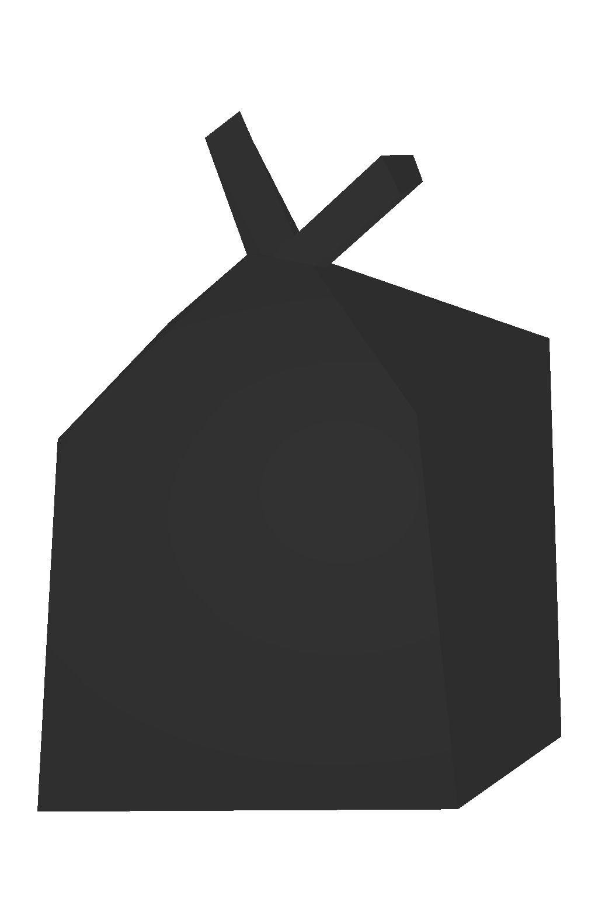
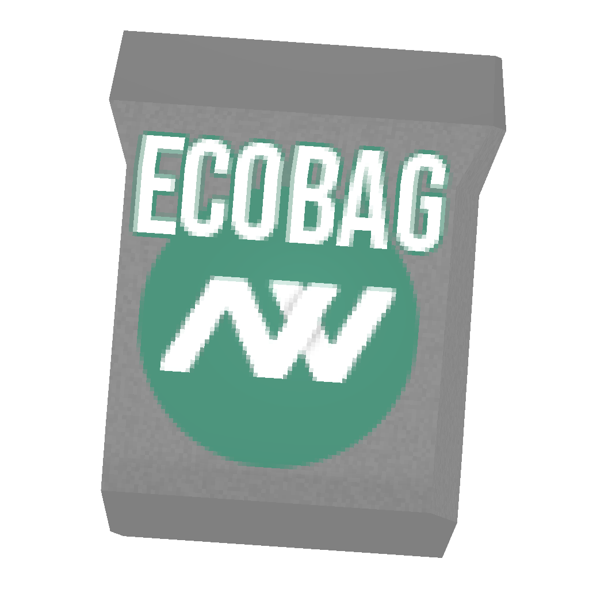
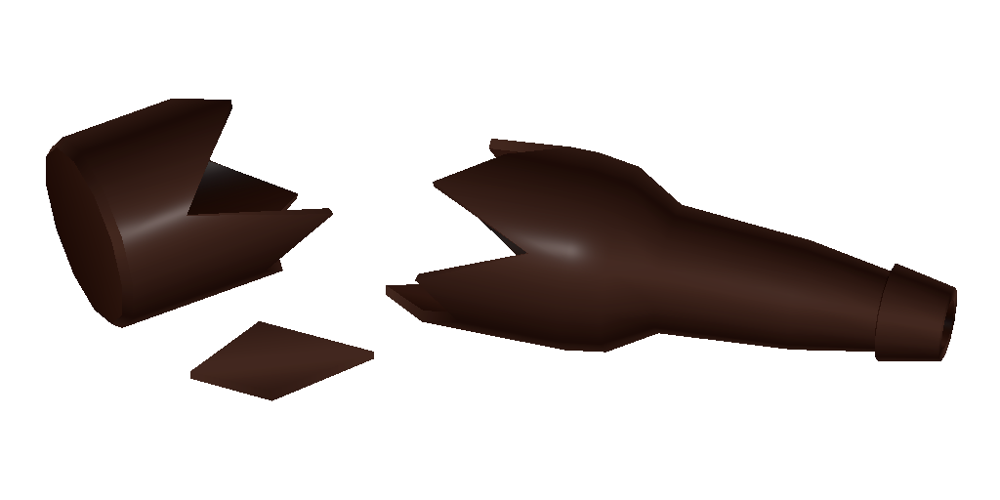

# ♻ Garbage

<table><thead><tr><th width="189.33333333333331">Name</th><th width="98">Info</th><th>Obtain</th></tr></thead><tbody><tr><td>Garbage Bag 12700/12701</td><td></td><td>Destroying garbage bag yellow/black.</td></tr><tr><td>Ecobag 12703</td><td></td><td>Using scrap trash and compacting it.</td></tr><tr><td>Trash 12702</td><td></td><td>By scraping yellow/black garbage bag.</td></tr><tr><td> Garbage</td><td></td><td>By scraping trash</td></tr></tbody></table>

