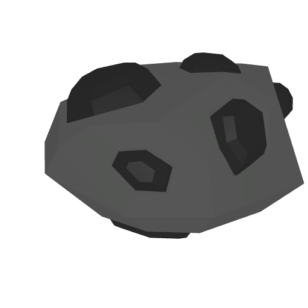
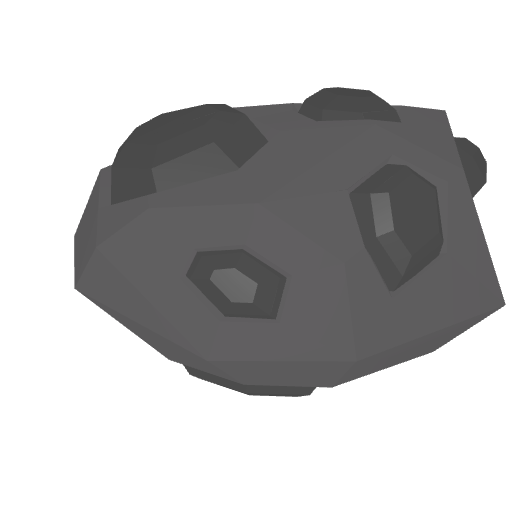
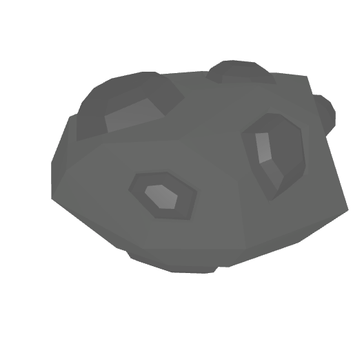
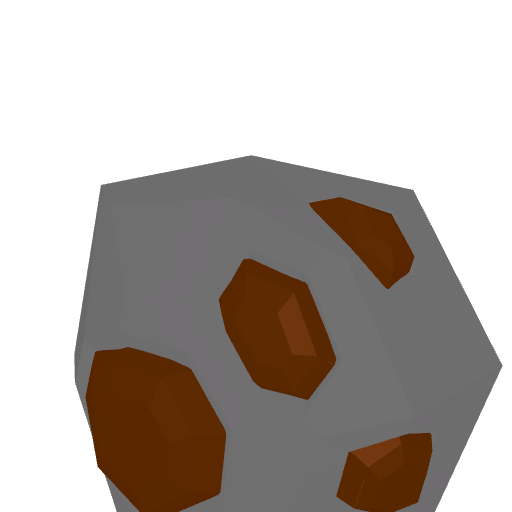
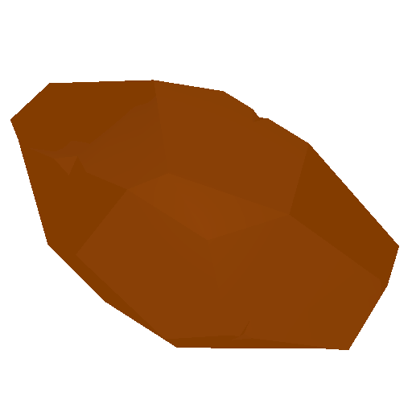
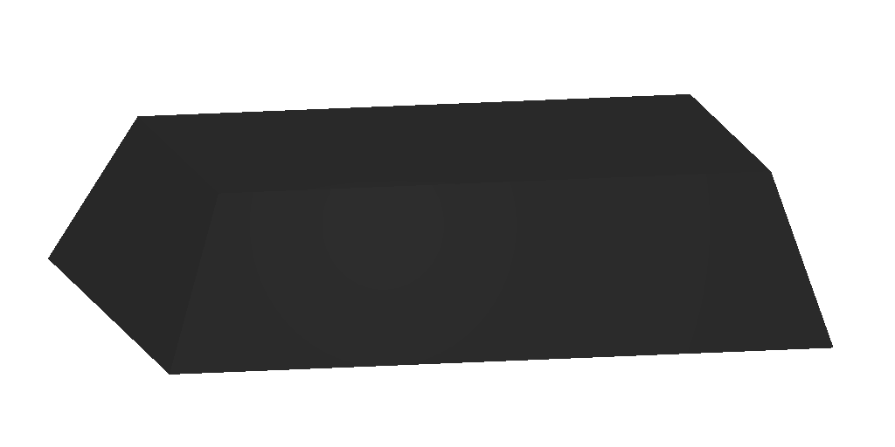
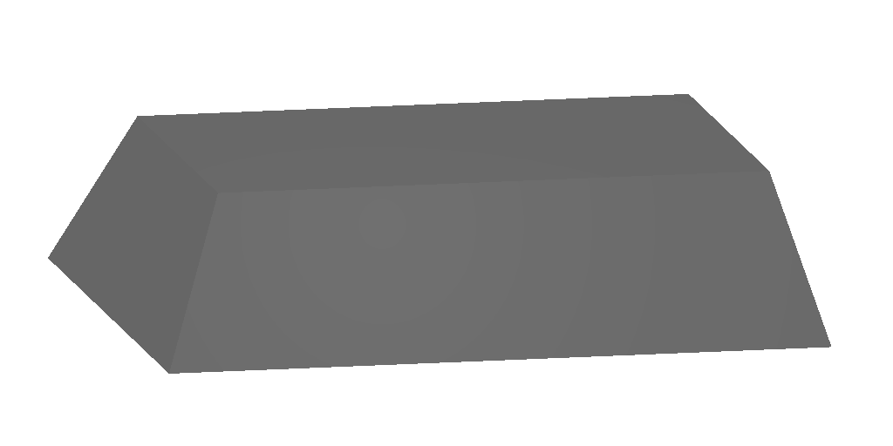
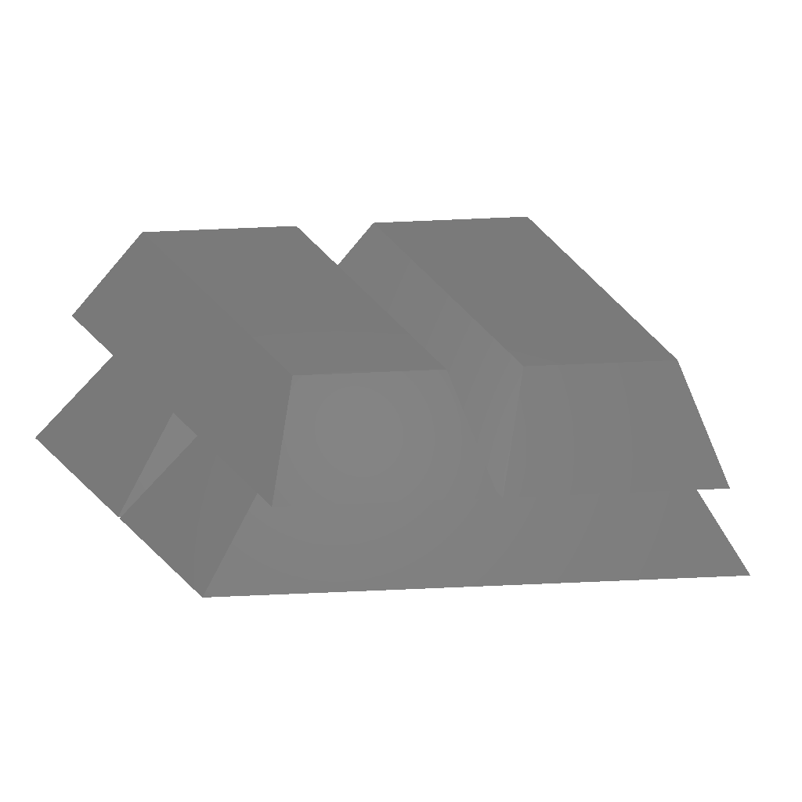

# ⛏ Mine

To acquire a T6 item, you must fulfill the following requirements: complete the <mark style="color:red;">**main quest**</mark>, possess the corresponding blueprint, and be a donator to craft it.


<mark style="color:red;background-color:orange;">**WORKING IN PROGRESS**</mark>\
**Current information are from BETA Stage, stuff may change in future.**




<table><thead><tr><th width="148.66666666666663">Name</th><th>Recipe</th><th>Info</th><th>Damage</th></tr></thead><tbody><tr><td>T1 Pickaxe</td><td>Available At NPC</td><td>🏹Range 0.8  💪Strength 1.5  ⚡Stamina 40</td><td>
🚧Barricade 10 

🏗️Structure 5 

🚗Vehicle 10 

🌳Resource 50 

🏢Object 10
</td></tr><tr><td>T2 Pickaxe</td><td>60 Pure Lead + 24 Pure Bauxite + 24 Pure Tin + 12 Pure Zinc</td><td>🏹Range 1.4 💪Strength 1.5  ⚡Stamina 36</td><td>
🚧Barricade 15 

🏗️Structure 10

🚗Vehicle 15 

🌳Resource 65 

🏢Object 15
</td></tr><tr><td>T3 Pickaxe</td><td>60 Pure Zinc + 36 Pure Tin + 12 Pure Lead + 12 Pure Iron</td><td>🏹Range 2  💪Strength 1.5  ⚡Stamina 32</td><td>
🚧Barricade 20 

🏗️Structure 15 

🚗Vehicle 20 

🌳Resource 80 

🏢Object 20
</td></tr><tr><td>T4 Pickaxe</td><td>60 Pure Iron + 12 Pure Tin + 12 Pure Copepr + 12 Pure Uranium + 12 Pure Silver + 10 Pure Gold + 10 Platinum</td><td>🏹Range 2.6 💪Strength 1.5  ⚡Stamina 28</td><td>
🚧Barricade 25 

🏗️Structure 20 

🚗Vehicle 25 

🌳Resource 95 

🏢Object 25
</td></tr><tr><td>T5 Pickaxe</td><td>60 Pure Copper + 12 Pure Iron + 12 Pure Uranium + 22 Pure Silver + 10 Pure Gold + 10 Pure Platinum + 10 Pure Diamond</td><td>🏹Range 3.2  💪Strength 1.5  ⚡Stamina 24</td><td>
🚧Barricade 30 

🏗️Structure 25 

🚗Vehicle 30 

🌳Resource 110 

🏢Object 30
</td></tr><tr><td>T6 Pickaxe</td><td>-</td><td>🏹Range 3.8 💪Strength 1.5  ⚡Stamina 20</td><td>
🚧Barricade 35

🏗️Structure 30 

🚗Vehicle 35 

🌳Resource 125

🏢Object 35
</td></tr><tr><td>T7 Pickaxe</td><td>-</td><td>🏹Range 3.8 💪Strength 1.5  ⚡Stamina 20</td><td>
🚧Barricade 35

🏗️Structure 30 

🚗Vehicle 35 

🌳Resource 125

🏢Object 35
</td></tr></tbody></table>




## Raw Ores

| Name                                                                              | Location / Requirement | Price |
| --------------------------------------------------------------------------------- | ---------------------- | ----- |
| Diamond   |                        |       |
| Platinum |                        |       |
| Nickel |                        |       |
| Gold         |                        |       |
| Silver     |                        |       |
| Copper     |                        |       |
| Iron         |                        |       |
| Zinc         |                        |       |
| Tin           |                        |       |
| Lead         |                        |       |
| Bauxite   |                        |       |
| Uranium   |                        |       |
| Coal         | Layer 1                |       |

<figure><figcaption>
A Raw stacked ore
</figcaption></figure>

Total Item: 13



| Name                                                                              | Recipe | Price |
| --------------------------------------------------------------------------------- | ------ | ----- |
| Diamond   |        |       |
| Platinum |        |       |
| Nickel     |        |       |
| Gold         |        |       |
| Silver     |        |       |
| Copper     |        |       |
| Iron         |        |       |
| Zinc         |        |       |
| Tin           |        |       |
| Lead         |        |       |
| Bauxite   |        |       |
| Uranium   |        |       |

<figure><figcaption>
A Pure stacked ore
</figcaption></figure>

Total Items: 12



## Ingots

<mark style="background-color:red;">Screenshot couldn't provide. Either Item image isn't full-scale or available.</mark>

<table><thead><tr><th width="237.66666666666666">Name</th><th>Recipe</th><th>Price</th></tr></thead><tbody><tr><td>Iron Ingot</td><td></td><td></td></tr><tr><td>Gold Ingot</td><td></td><td></td></tr><tr><td>Copper Ingot</td><td></td><td></td></tr><tr><td>Tin Ingot</td><td></td><td></td></tr><tr><td>Lead Ingot</td><td></td><td></td></tr><tr><td>Zinc Ingot</td><td></td><td></td></tr><tr><td>Silver Ingot</td><td></td><td></td></tr><tr><td>Platinum Ingot</td><td></td><td></td></tr><tr><td>Nickel Ingot</td><td></td><td></td></tr><tr><td>Alumina Ingot (Bauxite)</td><td></td><td></td></tr></tbody></table>

Total Items: 10











