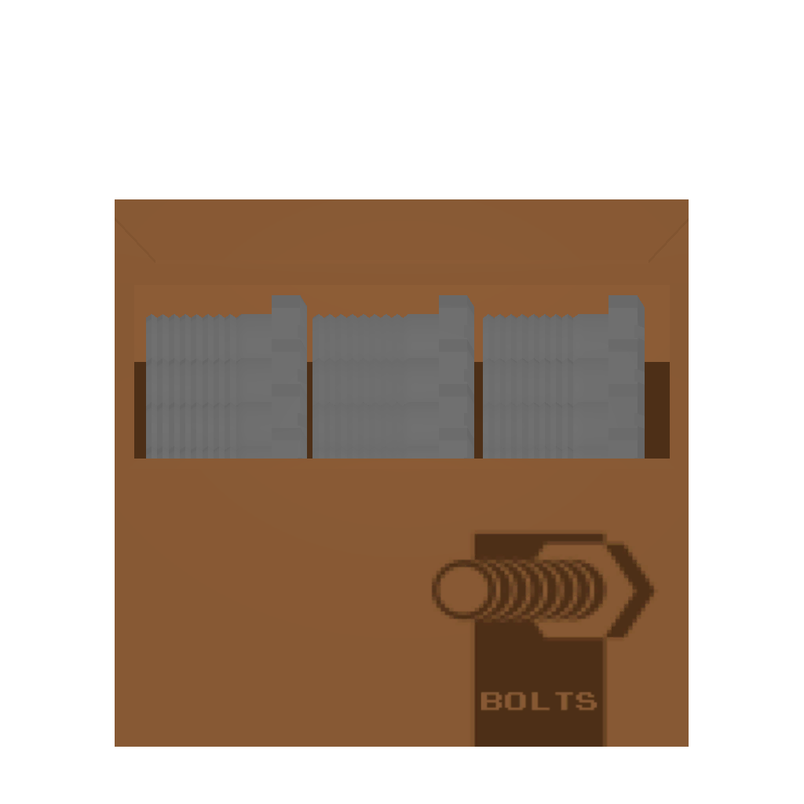

# 🥫 Supplies

<table data-full-width="true"><thead><tr><th width="150.33333333333331">Name</th><th>Info</th><th>Obtain</th></tr></thead><tbody><tr><td>Beeswax</td><td></td><td></td></tr><tr><td>Bolt</td><td></td><td></td></tr><tr><td>Box of bolts</td><td></td><td></td></tr><tr><td>Bugs</td><td></td><td></td></tr><tr><td>Carbon Fiber</td><td></td><td></td></tr><tr><td>Charcoal</td><td></td><td></td></tr><tr><td>Honey</td><td></td><td></td></tr><tr><td>Paint</td><td></td><td></td></tr><tr><td>PlasticBits</td><td></td><td></td></tr><tr><td>Resin</td><td></td><td></td></tr><tr><td>Rubber</td><td></td><td></td></tr></tbody></table>
